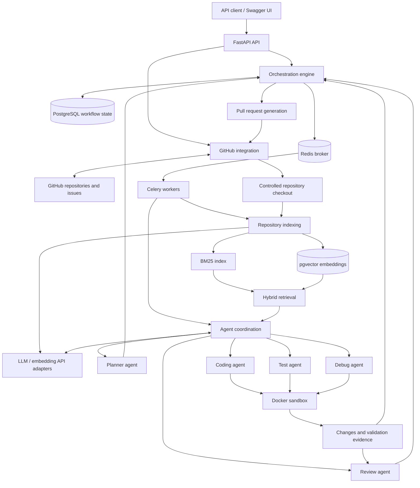

# AI Software Engineering Platform

> **Status: Minimal API, persistence, Celery tasks, GitHub imports, and local workspaces available.** The API provides health/readiness, diagnostic tasks, and repository/issue imports. Workers can prepare registered repository checkouts. Agents, indexing, LLM calls, and the issue-to-pull-request workflow remain PLANNED.

An AI-powered, multi-agent software engineering platform intended to turn GitHub issues into review-ready pull requests. The planned system will understand a repository, retrieve relevant code with hybrid BM25/vector search, build dependency-aware implementation plans, distribute work to workers, and coordinate coding, testing, debugging, and review in isolated Docker environments.

**The first version is backend/API focused.** FastAPI-generated Swagger UI and OpenAPI documentation provide the API exploration interface; a frontend is not required.

## Core goals — PLANNED

- Ground proposed changes in the issue requirements and the repository's actual code and conventions.
- Combine lexical BM25 search with semantic vector search to retrieve useful implementation context.
- Produce explicit task dependencies and dispatch work only when prerequisites are satisfied.
- Coordinate specialized agents through a durable, observable orchestration workflow.
- Validate generated changes in isolated containers and attempt bounded recovery when checks fail.
- Produce a review-ready GitHub pull request with a clear change summary and validation evidence.
- Keep external integrations replaceable and mockable, with no real service required for unit tests.

## Technology target — PLANNED

| Technology | Intended role |
| --- | --- |
| Python | Backend, agents, indexing, and orchestration |
| FastAPI | HTTP API and generated Swagger/OpenAPI documentation |
| PostgreSQL | Persistent workflow, repository, task, and execution records |
| pgvector | PostgreSQL extension for embedding storage and vector similarity search |
| Redis | Celery message broker and transient coordination/cache data |
| Celery | Background task execution and worker queues |
| Docker | Local service packaging and isolated validation environments |
| LLM APIs | Model-backed planning, coding, debugging, review, and embeddings through provider abstractions |

## Planned workflow

1. **Receive an issue:** accept an authorized GitHub repository and issue reference through the API.
2. **Prepare repository context:** obtain a controlled checkout at a recorded revision and inspect relevant repository instructions and configuration.
3. **Index the repository:** extract code and metadata, prepare a BM25 index, and generate embeddings for storage in pgvector.
4. **Retrieve context:** combine lexical and vector results, deduplicate candidates, and assemble relevant context with file and revision references.
5. **Plan implementation:** create tasks, dependencies, acceptance criteria, and validation requirements from the issue and retrieved context.
6. **Dispatch ready tasks:** use the orchestration engine to enqueue eligible work for Celery workers while tracking state and avoiding conflicting writes.
7. **Generate changes:** have coding agents implement assigned tasks in controlled workspaces.
8. **Validate in isolation:** have test agents run applicable tests, linting, and type checks inside Docker sandboxes and record outputs and exit codes.
9. **Attempt recovery:** on failure, have debug agents analyze evidence and propose fixes, then repeat validation within configured attempt and resource limits. Exhausted recovery must surface an explicit failure or request for human intervention.
10. **Review changes:** have review agents assess correctness, scope, security, and consistency with the plan and validation evidence.
11. **Prepare a pull request:** publish an authorized branch and open a review-ready GitHub pull request with a summary, test results, and known limitations. Human review remains part of the intended process; automatic merging is outside the initial scope.

## Planned architecture

This diagram describes the planned platform. The minimal API and local PostgreSQL/pgvector and Redis infrastructure exist; orchestration, agents, retrieval, and external platform integrations remain planned.



pgvector is enabled as an extension within local PostgreSQL, not as a separate database service. Planned agent roles are logical components executed by workers, not necessarily separate services. The orchestration engine will own workflow state and retry decisions; Redis will not be the authoritative store for durable workflow records.

## Main components — PLANNED

| Component | Intended responsibility |
| --- | --- |
| FastAPI API | Validate requests, expose workflow status and results, and provide Swagger/OpenAPI documentation. |
| PostgreSQL | Persist repository metadata, plans, task dependencies, run state, and validation records. |
| pgvector | Store code embeddings and support similarity queries tied to repository revisions. |
| Redis | Broker queued work and support transient caching or coordination where needed. |
| Celery workers | Execute indexing, agent, and validation jobs with explicit failure reporting. |
| Repository indexing | Extract and chunk relevant repository content while recording paths, revisions, and exclusions. |
| BM25 retrieval | Find lexical matches for identifiers, error messages, and code terminology. |
| Vector retrieval | Find semantically related code using embeddings behind a provider interface. |
| Hybrid retrieval | Fuse BM25 and vector candidates, deduplicate results, and select context within a budget. |
| GitHub integration | Access authorized issues and repositories and manage branches and pull requests through an abstracted client. |
| Planner agent | Translate requirements and repository context into dependency-aware implementation tasks. |
| Coding agent | Generate focused changes that follow repository instructions and task boundaries. |
| Test agent | Identify and run applicable checks and preserve genuine validation evidence. |
| Debug agent | Analyze failures and attempt scoped repairs within a bounded recovery policy. |
| Review agent | Evaluate changes and evidence against acceptance criteria and report unresolved concerns. |
| Orchestration engine | Manage task dependencies, durable state transitions, dispatch, cancellation, and recovery limits. |
| Docker sandbox | Execute generated code and checks with constrained resources, access, and lifetime. |
| Pull request generation | Prepare an authorized branch and pull request with traceable changes, validation results, and limitations. |

## Project directory structure

The following structure exists. Most component packages remain placeholders; health checks, configuration, persistence, diagnostic workers, and repository/issue imports are implemented. `.gitkeep` files preserve empty directories in Git.

```text
.
├── README.md
├── .gitignore
├── .env.example              # Development defaults and future placeholders
├── compose.yaml              # PostgreSQL/pgvector and Redis only
├── alembic.ini               # Migration configuration; no credentials
├── migrations/
│   ├── env.py                # Settings-backed migration runner
│   ├── script.py.mako
│   └── versions/
│       └── 0001_initial_persistence_schema.py
├── docker/
│   └── postgres/
│       └── init.sql          # Enables vector in a new database
├── pyproject.toml            # Python 3.12, dependencies, test/lint/type settings
├── app/                     # Installable application package
│   ├── __init__.py
│   ├── main.py              # FastAPI factory and lifespan
│   ├── api/
│   │   ├── status.py        # /health and /ready with response schemas
│   │   ├── tasks.py         # Diagnostic task submission/status
│   │   └── repositories.py  # Repository and issue import/read routes
│   ├── core/
│   │   └── config.py        # Centralized pydantic-settings configuration
│   ├── db/
│   │   ├── base.py          # UUID and timestamp conventions
│   │   └── session.py       # Engine and transactional sessions
│   ├── models/
│   │   ├── repository.py   # Repository, Issue, CodeChunk
│   │   ├── planning.py     # ImplementationPlan, PlanTask
│   │   └── execution.py    # ExecutionRun, TaskExecution, AgentRun, PullRequest
│   ├── schemas/
│   │   ├── tasks.py         # Diagnostic task response contracts
│   │   └── repositories.py  # Repository and issue response contracts
│   ├── services/
│   │   ├── readiness.py     # Mockable dependency probes and resource cleanup
│   │   ├── task_queue.py    # Mockable queue interface and Celery adapter
│   │   ├── repositories.py  # Transactional repository/issue imports
│   │   └── github_resources.py # Lifespan-owned HTTP and database resources
│   ├── integrations/
│   │   ├── github/
│   │   │   └── client.py    # GitHubClient protocol and httpx adapter
│   │   └── llm/
│   ├── indexing/
│   ├── retrieval/
│   ├── agents/
│   ├── orchestration/
│   ├── workers/
│   │   ├── celery_app.py    # Worker CLI entry point
│   │   ├── factory.py       # Settings-backed Celery configuration
│   │   └── tasks.py         # system.ping only
│   ├── sandbox/
│   └── pull_requests/
├── tests/
│   ├── unit/
│   │   ├── test_imports.py
│   │   ├── test_application.py
│   │   ├── test_session.py
│   │   ├── test_workers.py
│   │   └── test_github.py
│   └── integration/
│       ├── test_database.py # Isolated PostgreSQL migration/ORM tests
│       ├── test_infrastructure.py  # Opt-in checks against running services
│       └── test_worker.py   # Opt-in real Redis/Celery/API test
├── scripts/                 # Empty
└── docs/                    # Empty
```

Each directory under `app/` contains an `__init__.py`. The initial database migration is available; application containers remain planned. Compose currently runs only PostgreSQL/pgvector and Redis.

## Development roadmap — PLANNED

The phases below indicate intended sequencing, not completed capabilities or permission to implement additional steps.

1. **Project documentation:** initial README available.
2. **Backend foundation:** Python 3.12 scaffold, typed settings, minimal FastAPI endpoints, lifespan management, and automated tests/lint/type checks are available. Broader application behavior remains planned.
3. **Persistence and background execution (partial):** local PostgreSQL/pgvector and Redis, nine models, migrations, and Celery diagnostic execution are available. Business task execution remains planned.
4. **Repository access:** mockable GitHub REST adapter, repository/issue imports, and managed repository checkout are available.
5. **Indexing and retrieval:** implement repository indexing, BM25, embeddings, pgvector queries, and hybrid retrieval evaluation.
6. **Planning and orchestration:** implement dependency-aware plans, persisted task state, and worker dispatch.
7. **Coding and isolated validation:** add coding/test agents and the Docker sandbox execution interface.
8. **Recovery and review:** add bounded debugging loops and review-agent feedback with explicit failure states.
9. **Pull request delivery:** integrate branch publication and review-ready pull request generation.
10. **Hardening:** validate security boundaries, reliability, observability, and end-to-end behavior.

## Security considerations — PLANNED

- **Secrets:** load credentials from environment variables or a future secret manager. Keep real credentials out of source control, example configuration, logs, tests, model prompts, and pull requests. `.env.example` contains public development-only defaults and empty placeholders, never real secrets.
- **Least privilege:** restrict GitHub credentials to the required repositories and operations. Define API authentication, authorization, and repository access controls before exposing the service.
- **Untrusted inputs:** treat issue text, repository content, model output, and generated code as untrusted. Repository instructions must not override platform security policy or authorize credential disclosure and unrelated actions.
- **Container boundaries:** use non-root execution, resource and time limits, restricted networking, and narrow filesystem mounts. Do not expose host secrets or the Docker socket to generated-code containers. Docker isolation requires hardening and is not a complete security boundary by itself.
- **Data handling:** exclude secrets and sensitive files from indexing and embedding requests. Define what repository content may be sent to external LLM providers and establish retention and cleanup policies.
- **Controlled execution:** validate paths and execution parameters, prevent access outside assigned workspaces, and record commands, exit codes, and relevant artifacts without leaking sensitive data.
- **Bounded automation:** cap retries, execution time, and model usage. Report exhausted recovery and failed checks explicitly rather than silently proceeding.
- **Traceability:** tie changes and retrieval results to repository revisions and retain enough evidence for human review. Publishing permissions and policy must be explicit before external writes are enabled.

Platform security controls remain planned. Local infrastructure publishes ports only on loopback and uses development-only configuration; it is not a production deployment.

## Local scaffold development

Use **Python 3.12.x**. The project uses a consistent `app/` package layout and an editable installation. Runtime dependencies are declared for FastAPI, uvicorn, SQLAlchemy, psycopg (with binary support), Alembic, pydantic-settings, Redis, Celery, and httpx. Development dependencies provide pytest, pytest-asyncio, Ruff, and mypy.

From the repository root in PowerShell:

```powershell
# Create the environment only if it does not already exist.
py -3.12 -m venv .venv
.\.venv\Scripts\python.exe -m pip install -e ".[dev]"
.\.venv\Scripts\python.exe -m pytest --collect-only -q
.\.venv\Scripts\python.exe -m pytest
.\.venv\Scripts\python.exe -m ruff check .
.\.venv\Scripts\python.exe -m ruff format --check .
.\.venv\Scripts\python.exe -m mypy
.\.venv\Scripts\python.exe -m pip check
```

On POSIX systems, create the environment with `python3.12 -m venv .venv` and use `.venv/bin/python` for the remaining commands. Activation is optional when invoking the environment's interpreter directly.

The import smoke test exercises the scaffold packages without credentials or running services. Ruff checks formatting, imports, and common Python errors; mypy uses strict checking for application packages and tests. Dependency ranges are declared, but a reproducible lockfile is not yet provided.

The default test run skips opt-in infrastructure tests; unit tests use isolated settings and mockable dependency probes without `.env`, Docker, services, or API keys. Compose consumes infrastructure settings and the application loads its configuration using pydantic-settings. Future generated repository checkouts should live under the ignored `workspaces/` directory; any alternative location will need its own exclusion policy.

**PLANNED:** further business routes, indexing/agent tasks, and LLM integrations. Dependency probes, queues, GitHub HTTP access, and Git execution have injectable interfaces. Import routes read GitHub metadata; workspace tasks clone/fetch registered repositories. No LLM calls are made.

## Minimal API

Start the API from the repository root (no secrets are required for startup or liveness):

```powershell
.\.venv\Scripts\python.exe -m uvicorn app.main:create_app --factory --reload --host 127.0.0.1 --port 8000
```

Swagger UI is at `http://127.0.0.1:8000/docs` and the OpenAPI schema is at `http://127.0.0.1:8000/openapi.json`.

| Endpoint | Success | Dependency unavailable or unconfigured |
| --- | --- | --- |
| `GET /health` | HTTP 200, `{"status":"ok"}` | Still HTTP 200; no dependency calls |
| `GET /ready` | HTTP 200, `{"status":"ready","dependencies":{"postgres":{"status":"ok"},"redis":{"status":"ok"}}}` | HTTP 503, `status: "not_ready"`; each dependency reports `ok`, `error`, or `unconfigured` |

To make readiness succeed, start Compose as described below and provide matching `DATABASE_URL` and `REDIS_URL` through environment variables or a local `.env` copied from `.env.example`. No `.env` is required for the process to start; missing URLs produce explicit `unconfigured` readiness results. Do not overwrite an existing `.env`.

```powershell
Invoke-RestMethod http://127.0.0.1:8000/health
Invoke-RestMethod http://127.0.0.1:8000/ready
```

Settings load once per application factory call, using constructor overrides, environment variables, then `.env` in the current working directory, then defaults. Environment names are case-insensitive; empty environment/file values use defaults. Unrelated `.env` fields are ignored so Compose and the API can share a file. Restart the API after changing settings. Tokens, keys, and connection URLs use `SecretStr`; do not explicitly unwrap or log them.

Lifespan creates lazy clients and closes them on shutdown or partial startup failure. Service outages do not prevent startup. `/ready` performs PostgreSQL `SELECT 1` and Redis `PING` in FastAPI's worker thread pool, with configurable connection/socket/pool/statement timeouts and no Redis retries. These are per-operation timeouts, not a strict total request deadline. Failures return sanitized status and log only the dependency name; subsequent requests retry the checks. `LOG_LEVEL` controls the `app` logger; uvicorn retains its own logging configuration.

`DATABASE_URL` requires the installed SQLAlchemy driver scheme `postgresql+psycopg://`; Redis accepts `redis://` or `rediss://`. Optional GitHub/LLM settings are stored only. `EMBEDDING_DIM` defaults to 1536; the initial persistence schema fixes the vector column at 1536 dimensions. Changing the setting does not alter the database; a new migration is required to resize stored embeddings. No embedding model or generation is implemented.

## Celery diagnostic worker

Configure `CELERY_BROKER_URL` and `CELERY_RESULT_BACKEND` using the local samples in `.env.example`, through the shell or your ignored `.env`. They use Redis databases 1 and 2; `REDIS_URL` remains database 0 for readiness. The worker and API must use the same broker and result backend. Future containers on the Compose network use `redis:6379` instead of `127.0.0.1`. Compose still runs infrastructure only.

Start Redis with `docker compose up -d --wait`, then open a separate terminal at the repository root. For the Windows development smoke test:

```powershell
.\.venv\Scripts\python.exe -m celery -A app.workers.celery_app:app worker --pool=solo --concurrency=1 --queues=orchestration,indexing,agents --loglevel=INFO
```

The worker should list `system.ping` and `repository.prepare_workspace`, then report `ready`. Stop it with Ctrl+C. Windows/`solo` is a development smoke-test arrangement, not a parallel production worker: `solo` runs one task at a time and does not enforce prefork task time limits. For Linux workers with process-based concurrency, use `--pool=prefork --concurrency=2` instead. See the [Celery concurrency documentation](https://docs.celeryq.dev/en/latest/userguide/concurrency/).

Start FastAPI in another terminal using the command above, then submit and inspect a task:

```powershell
$task = Invoke-RestMethod -Method Post http://127.0.0.1:8000/tasks/ping
Invoke-RestMethod "http://127.0.0.1:8000/tasks/$($task.task_id)"
```

`POST /tasks/ping` returns HTTP 202 with a UUID `task_id`, `task_name: "system.ping"`, and `status: "queued"`. Poll `GET /tasks/{task_id}` for `state: "SUCCESS"` and `result` containing the task ID/name, worker, queue, retry count, UTC completion time, and `status: "ok"`. Submission confirms publication, not worker completion. The API never waits for execution.

Queue configuration is explicit: diagnostic and workspace tasks route to `orchestration`; `indexing` and `agents` remain reserved. Only JSON messages/results are accepted. Diagnostic limits are 20 seconds soft and 30 seconds hard; workspace limits are 900/960 seconds. Redis visibility timeout is one hour. Prefetch is 1, results expire after one hour, broker/backend retries are bounded, and diagnostic connection/timeout retries use backoff and jitter (maximum 3). Workspace tasks are not automatically retried. `LOG_LEVEL` provides the worker default; CLI `--loglevel` overrides it. Worker imports create no database engines or connections.

Missing Celery URLs leave the health endpoints available but make `/tasks` return HTTP 503. Broker/backend failures also return sanitized 503 responses; task failures are reported through `state` without raw exceptions. Unknown, expired, and queued task IDs may all appear as `PENDING`: this step does not persist a submission registry or promise 404 for unknown UUIDs. A failed publish response can be ambiguous; retrying submission may enqueue another task. These local diagnostic endpoints have no authentication yet and should remain bound to localhost. `/ready` checks PostgreSQL and Redis, not worker availability.

Unit tests use injected queues and direct/eager task execution, without Redis. To exercise an actual Celery `solo` worker over Redis, configure both Celery URLs and run:

```powershell
$env:RUN_WORKER_TESTS = '1'
.\.venv\Scripts\python.exe -m pytest tests/integration/test_worker.py -v
Remove-Item Env:RUN_WORKER_TESTS
```

The integration test starts/stops a test worker, uses a unique queue, submits through FastAPI, and polls the shared Redis result backend. It removes its result and queue afterward. Do not run a separate worker for this test. No PostgreSQL data, indexing jobs, or agent behavior are involved.

## GitHub repository and issue imports

The API can register repository metadata and import a single GitHub issue into PostgreSQL.
Apply `alembic upgrade head` using the existing database setup, then start the API as above.
No new migration is needed. These endpoints do not clone, index, run agents, or write to GitHub.

| Endpoint | Behavior |
| --- | --- |
| `POST /repositories` | JSON `{ "github_owner": "OWNER", "github_name": "REPOSITORY" }`; fetch canonical GitHub metadata and upsert locally |
| `POST /repositories/{repository_id}/issues/{issue_number}/import` | Fetch and upsert one issue for the registered repository |
| `GET /repositories/{repository_id}` | Read locally stored metadata without contacting GitHub |
| `GET /issues/{issue_id}` | Read the locally stored issue without contacting GitHub |

Success returns HTTP 200 and structured records with UUIDs and UTC timestamps. Repeat imports
preserve IDs and refresh metadata; repository identity is case-insensitive and issue numbers
are unique within a repository. Import preserves local/index status. Creation timestamps are
local record timestamps, not GitHub creation times. GitHub pull requests are rejected as issue
imports with HTTP 422.

In Swagger at `/docs`, register a repository you can access, copy its returned `id`, and use
that ID with a positive issue number in the import endpoint. Use the returned issue `id` in
`GET /issues/{issue_id}` to verify persistence. Invalid inputs return 422; unknown local IDs
return 404. Start PostgreSQL and apply migrations before using these routes.

`GitHubClient` defines the integration boundary; `HttpGitHubClient` contains all GitHub HTTP
operations. The lifespan owns the HTTP pool and lazy database engine. Each operation uses
short transactions that commit or roll back and close. GitHub reads finish before write
transactions. Tests use `httpx.MockTransport`, including imports into an isolated real PostgreSQL
test database. Unit tests need neither tokens nor running services.

The adapter also supplies branch SHA lookup, branch creation, and PR creation/retrieval for
later steps. These have mocked contract tests, with no public write endpoints or workflow
callers. File updates and issue listing are deferred until a workflow requires them.

Errors return `detail.code`, never upstream bodies, tokens, or database details:

| Condition | HTTP / code |
| --- | --- |
| GitHub rejects authentication | 401 / `github_unauthorized` |
| GitHub permission denied | 403 / `github_forbidden` |
| GitHub missing/inaccessible resource | 404 / `github_not_found` |
| Primary/secondary GitHub rate limit | 429 / `github_rate_limited`, with `Retry-After` |
| Network failure/timeout | 503 / `github_unavailable` |
| Other upstream error, redirect, or malformed payload | 502 / `github_response_error` or `github_invalid_response` |
| Missing/unavailable database | 503 / `database_unconfigured` or `database_unavailable` |

Rate-limit responses use GitHub's retry delay or reset timestamp, falling back to 60 seconds.
Requests are not automatically replayed, especially writes; callers must respect the returned
wait time. See [GitHub rate-limit guidance](https://docs.github.com/en/rest/using-the-rest-api/rate-limits-for-the-rest-api).
Redirects are not followed; submit the canonical identity when a repository has moved.
`GITHUB_API_URL` defaults to `https://api.github.com`; an Enterprise HTTPS base URL ending in
`/api/v3` is supported. Only trusted operator configuration sets this URL; requests cannot choose
a host. The base URL must not contain credentials, queries, or fragments.

`GITHUB_TOKEN` is optional for public repository reads. Automated tests make no real GitHub
requests. For optional private-repository testing, create a fine-grained token under GitHub
**Settings → Developer settings → Personal access tokens**, select only the intended repository,
and grant **Metadata: read** and **Issues: read**, with organization approval if required.
Store it locally in `GITHUB_TOKEN` through the ignored `.env` or shell, then restart the API.
Never paste it into chat. Verify through `/docs`: repository and issue imports should return
HTTP 200 with local UUIDs and matching metadata. No write permissions are needed for these
endpoints. Local API authentication remains planned; keep the API bound to loopback because
imported private issue content is accessible through local reads.

## Repository workspaces

`WorkspaceService` manages disposable local copies; it does not index code or execute repository
programs. Git must be installed on the worker host (`git --version`). The default `WORKSPACE_ROOT`
is `workspaces`, resolved relative to the worker's working directory. Use the same absolute root
when several worker processes share a filesystem. Existing `.gitignore` rules exclude the default
directories; the service also creates a local ignore-all file inside a new custom root.

Paths use UUIDs, never repository names or request-supplied path components:

```text
WORKSPACE_ROOT/
  repositories/<repository UUID>/
  executions/<repository UUID>/<execution UUID>/
  locks/<repository UUID>.lock
```

`prepare` clones a repository or fetches updates, checks out its registered default branch, resets
to the remote commit, and removes tracked modifications plus untracked/ignored files. These are
disposable workspaces: do not keep user work in them. `reset` accepts an existing full commit SHA.
`create_execution` makes an independent detached clone at the prepared commit, with no shared
object store or remote. Existing execution IDs are rejected rather than overwritten. A result
contains the local path and exact commit SHA. Git integrity checks run before/after preparation.

The Git adapter runs argument lists without a shell, disables hooks, credential helpers, redirects,
and interactive prompts, and limits each command to 120 seconds. Production cloning accepts HTTPS
only for the configured GitHub host (`github.com`, or the host in Enterprise `GITHUB_API_URL`).
Tokens never enter clone URLs, Git configuration, task arguments, or logs. The askpass helper receives
`GITHUB_TOKEN` only through the Git subprocess environment. Execution clones receive no token.
Local filesystem remotes are an explicit test-only injection option, not a settings switch.

Per-repository exclusive lock files serialize changes on one filesystem. UUID validation and
containment checks reject symlinks/junctions in managed paths. The root must be writable only by
trusted platform processes; these checks and isolated copies are not a sandbox against hostile
processes with access to the same files. Symlinks in repository content are checked out as ordinary
files. Submodules and Git LFS downloads are not prepared. Empty repositories without a commit cannot
be prepared. Full clones/integrity checks can be expensive for large repositories.

With PostgreSQL/Redis running and the worker started as above, enqueue a registered repository
from a local Python shell (replace the UUID placeholder):

```python
from app.workers.celery_app import app

task = app.send_task("repository.prepare_workspace", args=["REGISTERED_REPOSITORY_UUID"])
print(task.id)
print(task.state)
```

Poll the same task with `app.AsyncResult(task_id).state`; after `SUCCESS`, `.result` contains
`repository_id`, `status: ready`, and `commit`. The `/tasks` HTTP endpoints remain diagnostic-only
and must not be used to inspect workspace results. `GET /repositories/{id}` shows persisted
`local_status`: `pending`, `syncing`, `ready`, or `error`. Sync invalidates `index_status` to `pending`;
no indexing is performed. No migration or new HTTP endpoint is needed. Database resources are
created inside task execution and always disposed. Failures surface sanitized Celery errors.

A worker crash/hard timeout may leave `syncing`, a lock, or a `.partial-*` directory. After confirming
no worker/Git process owns that repository, an operator may remove only that lock/partial directory
under the configured root and resubmit. There is no automatic stale-lock deletion, disk quota, or
workspace garbage collector in this step. Workers on unrelated filesystems have separate copies;
distributed host ownership and stale-worker recovery remain future orchestration concerns.

Local tests use temporary Git repositories and synthetic credentials; no GitHub token is required.
For optional private clone testing, a fine-grained `GITHUB_TOKEN` additionally needs **Contents: read**
for the registered repository, alongside the metadata/issue read permissions above. Configure it
only locally and restart the worker. Enqueue the task and expect `SUCCESS`, `status: ready`, and a
commit SHA; never paste the token into chat.

Implementation modules: `app/services/workspace.py`, `app/services/workspace_sync.py`,
`app/integrations/git/runner.py`, `app/integrations/git/askpass.py`, and `app/workers/workspaces.py`.

## PostgreSQL persistence

Install the current dependencies with `python -m pip install -e ".[dev]"` in the virtual environment. Provide `DATABASE_URL` through the environment or a local `.env` based on `.env.example`, then start local infrastructure and run:

```powershell
.\.venv\Scripts\python.exe -m alembic upgrade head
.\.venv\Scripts\python.exe -m alembic current
.\.venv\Scripts\python.exe -m alembic check
```

Expected: revision `0001 (head)` and no new upgrade operations. Migrations are explicit; API startup does not modify the schema. Alembic uses the centralized Settings object and enables `vector` with `CREATE EXTENSION IF NOT EXISTS`, even on a database not initialized by Docker's SQL script. The database role must be allowed to create tables, functions, and the extension. No credentials are stored in `alembic.ini`.

| Model | Persisted role and relationships |
| --- | --- |
| Repository | GitHub identity, clone URL, default branch, separate local/index status |
| Issue | Repository FK, repository-scoped GitHub issue number, issue content and state |
| CodeChunk | Repository FK, file/line range, content/hash, nullable `vector(1536)` |
| ImplementationPlan | Issue FK, status and summary |
| PlanTask | Plan FK, plan-scoped task key, JSONB dependency keys/target paths, sequence |
| ExecutionRun | Plan FK, status, optional branch and execution times |
| TaskExecution | Run/task FKs, positive attempt, status and output summary |
| AgentRun | Run FK, optional task-execution FK, agent/model, JSONB metadata, optional tokens and USD cost |
| PullRequest | Run FK (one PR per run), positive GitHub PR number, URL and status |

Every record has a UUID primary key and timezone-aware `created_at`/`updated_at` columns. UUIDs and creation timestamps have database defaults; update triggers refresh `updated_at` for ORM and raw SQL writes. Foreign keys prevent orphaned records and parent deletion while dependents remain. Uniqueness constraints cover case-insensitive GitHub repository identity, repository issue numbers, plan task keys, and per-run/task attempts. Costs use decimal precision, not floats.

Status columns are strings with initial defaults, not implemented state machines. Task dependency keys are stored as JSONB arrays; dependency resolution, cycle checks, cross-plan execution consistency, and scheduling are future service concerns. JSONB lists/dicts track top-level in-place edits; replace nested values to persist nested edits reliably. No retrieval indexes or embedding generation are introduced.

Use `create_database_engine(Settings())`, `create_session_factory(engine)`, and `with session_scope(factory) as session:` from `app.db.session`. Sessions commit on success, roll back on exceptions, and always close. Engines are caller-owned and must be disposed on shutdown. No global session or speculative CRUD/repository service is added; no business endpoints use sessions yet. Apply Alembic migrations rather than `Base.metadata.create_all()` so database triggers and extensions are included.

Database tests are opt-in and require `TEST_DATABASE_URL` pointing to a local PostgreSQL server where the role has `CREATEDB` and extension privileges. The tests create a uniquely named temporary database, migrate it, verify round trips/constraints/rollback and downgrade/upgrade, then drop only that temporary database. They do not downgrade or erase the development database.

```powershell
# Set TEST_DATABASE_URL locally to your development PostgreSQL URL first.
$env:RUN_DATABASE_TESTS = '1'
.\.venv\Scripts\python.exe -m pytest tests/integration/test_database.py -v
Remove-Item Env:RUN_DATABASE_TESTS
```

`TEST_DATABASE_URL` must be a shell environment variable for the tests (it is not automatically loaded from `.env`). Unit tests still require no database. `alembic downgrade base` removes the application tables and their data; use it only on disposable databases. Downgrade retains the pgvector extension because other schemas may depend on it.

## Local infrastructure

Docker Desktop must be running in **Linux containers** mode with Docker Compose v2. Verify with `docker version` (both Client and Server sections), `docker compose version` (v2), and `docker info --format '{{.OSType}}'` (`linux`). If Docker is unavailable, install/start Docker Desktop and resolve its startup errors before continuing.

From the repository root:

```powershell
docker compose config --quiet
docker compose up -d --wait --wait-timeout 180
docker compose ps
```

Both `postgres` and `redis` should report **healthy**. The defaults work without a `.env` file. To customize them, copy `.env.example` to `.env` only if `.env` does not already exist, then edit it locally. Never commit `.env`. Shell variables take precedence over `.env`. Prefer `config --quiet` because full rendered configuration can expose passwords.

- PostgreSQL uses the [pgvector project's image](https://github.com/pgvector/pgvector#docker), `pgvector/pgvector:pg16`. A read-only initialization SQL file enables `vector` in `POSTGRES_DB` on the first startup of an empty data volume. No package installation occurs at runtime.
- Redis uses `redis:7.4-alpine` with [AOF persistence](https://redis.io/docs/latest/operate/oss_and_stack/management/persistence/) and `appendfsync everysec`. Both services have healthchecks and separate named volumes.
- Published ports bind only to `127.0.0.1`. The public sample database password is for local development only. Redis has no authentication and must remain local; other containers on the Compose network can access both services.
- No FastAPI or Celery container is defined. These data services are not the future untrusted-code sandbox.

Verify service behavior, including an authenticated PostgreSQL query and pgvector operation:

```powershell
$env:RUN_INFRASTRUCTURE_TESTS = '1'
.\.venv\Scripts\python.exe -m pytest tests/integration/test_infrastructure.py -v
Remove-Item Env:RUN_INFRASTRUCTURE_TESTS
docker compose exec -T redis redis-cli ping
```

Expected: two passing integration tests and `PONG`. Tests are read-only and require services to be started explicitly; they do not create or remove containers.

### Host and future container connections

| Caller | PostgreSQL address | Redis address |
| --- | --- | --- |
| Local Python process | `127.0.0.1:5432` (or `POSTGRES_PORT`) | `127.0.0.1:6379` (or `REDIS_PORT`) |
| Future service on the same Compose network | `postgres:5432` | `redis:6379` |

`.env.example` supplies host-side URL samples. Future application containers must override `DATABASE_URL` to use `postgres:5432` and Redis URLs to use `redis:6379`; `localhost` inside a container refers to that container. Host port overrides do not change internal service ports. Keep database name, username, password, and URLs consistent when customizing; URL-encode special characters in URL credentials. URL values in the example are explicit samples and do not automatically track changes to `POSTGRES_*`.

### Stop, restart, and persistence

```powershell
docker compose stop
docker compose up -d --wait --wait-timeout 180
# Remove containers and network while keeping database/Redis volumes:
docker compose down
```

Named volumes survive container removal and recreation. Do not use `docker compose down --volumes` unless you intentionally want to delete all local database and Redis data. PostgreSQL initialization variables and `init.sql` apply only to a fresh volume: changing `.env` does not change existing database credentials or rerun initialization. Existing databases require an explicit credential/database update; do not erase their volume as a routine configuration fix.

If host ports are occupied, set unused `POSTGRES_PORT` / `REDIS_PORT` values locally and update host-side URLs. Inspect health failures with `docker compose ps` and `docker compose logs postgres redis`; avoid sharing logs that contain sensitive information. Image tags track their major release lines rather than immutable digests. AOF every-second syncing can lose roughly a second of recent writes after a crash; this setup is development infrastructure, not a backup solution.

## Environment variables

Compose consumes the five infrastructure variables below. Settings consumes API fields, PostgreSQL/Redis/Celery URLs, optional GitHub/LLM fields, and embedding model/dimension. Provider selection, sandbox, and workspace placeholders remain unused. No real credentials are included.

| Variable name | Intended purpose |
| --- | --- |
| `POSTGRES_DB` | Initial database name; defaults to `platform_dev` |
| `POSTGRES_USER` | Initial development database superuser; defaults to `platform_dev` |
| `POSTGRES_PASSWORD` | Initial password; public local-development-only default |
| `POSTGRES_PORT` | Loopback host port; defaults to `5432` |
| `REDIS_PORT` | Loopback host port; defaults to `6379` |
| `APP_ENV` | Runtime environment selection |
| `APP_NAME` | FastAPI title; defaults to AI Software Engineering Platform |
| `LOG_LEVEL` | Application logging verbosity |
| `DEPENDENCY_TIMEOUT_SECONDS` | Per-operation dependency timeout; integer 1–30, default 2 |
| `API_HOST` | API bind address |
| `API_PORT` | API listening port |
| `DATABASE_URL` | PostgreSQL connection configuration; may contain credentials |
| `TEST_DATABASE_URL` | Opt-in test server URL; requires temporary database creation privileges |
| `REDIS_URL` | Redis connection configuration; may contain credentials |
| `CELERY_BROKER_URL` | Celery broker connection configuration |
| `CELERY_RESULT_BACKEND` | Celery result backend configuration, if used |
| `GITHUB_TOKEN` | GitHub authentication credential for the selected token-based approach |
| `GITHUB_API_URL` | GitHub API endpoint configuration |
| `LLM_PROVIDER` | Selected LLM provider adapter |
| `LLM_API_KEY` | LLM provider credential |
| `LLM_MODEL` | Model identifier for agent requests |
| `LLM_BASE_URL` | Provider endpoint override, if supported |
| `EMBEDDING_PROVIDER` | Selected embedding provider adapter |
| `EMBEDDING_API_KEY` | Embedding provider credential, if separately required |
| `EMBEDDING_MODEL` | Model identifier for code embeddings |
| `EMBEDDING_DIM` | Embedding dimension; initial schema uses 1536, resizing requires migration |
| `REPOSITORY_WORKSPACE_ROOT` | Legacy unused placeholder; use `WORKSPACE_ROOT` |
| `WORKSPACE_ROOT` | Active managed checkout root; defaults to `workspaces`. The older `REPOSITORY_WORKSPACE_ROOT` placeholder remains unused. |
| `SANDBOX_IMAGE` | Approved container image for validation |
| `SANDBOX_TIMEOUT_SECONDS` | Maximum duration of a sandbox execution |
| `SANDBOX_MEMORY_LIMIT` | Container memory limit |
| `SANDBOX_CPU_LIMIT` | Container CPU limit |
| `MAX_RECOVERY_ATTEMPTS` | Maximum automated repair attempts per configured recovery scope |

Credential values must be supplied locally through the appropriate environment variables or a future secret-management integration, never pasted into project documentation or committed to Git.

## Current project status

- **Present:** Settings, health/readiness and diagnostic task APIs, Celery/Redis queues, local infrastructure, nine SQLAlchemy models, sessions/migrations, GitHub repository/issue imports, unit tests, and opt-in database/worker/infrastructure tests.
- **Present:** managed Git checkout/update/reset, independent execution copies, and the Celery workspace preparation task. Indexing remains pending.
- **PLANNED:** further business APIs, agents, indexing/retrieval, orchestration, LLM integrations, sandbox execution, and pull request workflows.
- **Not yet created:** agent/orchestration business logic, LLM integration implementations, and application containers.
- **Initial interface target:** backend/API access with FastAPI Swagger/OpenAPI documentation; no frontend is required for the first version.

Implementation will proceed one explicitly requested step at a time.
