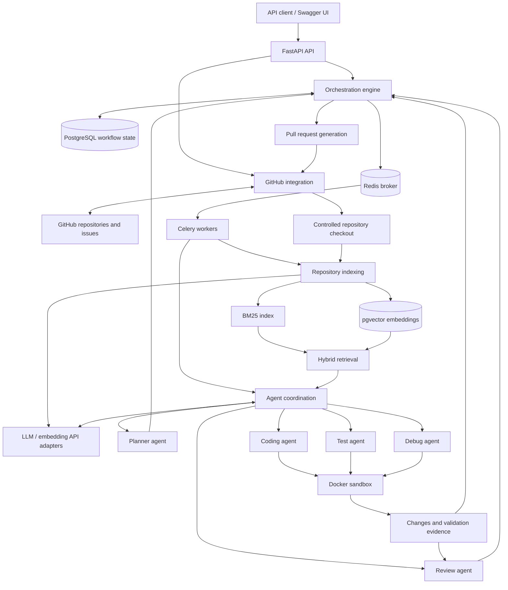

# AI Software Engineering Platform

> **Status: PLANNED — documentation only.** No application code, integrations, agents, infrastructure, or runnable development environment have been implemented. The workflows, architecture, directory structure, and configuration below describe the intended system.

An AI-powered, multi-agent software engineering platform intended to turn GitHub issues into review-ready pull requests. The planned system will understand a repository, retrieve relevant code with hybrid BM25/vector search, build dependency-aware implementation plans, distribute work to workers, and coordinate coding, testing, debugging, and review in isolated Docker environments.

**The first version is planned to be backend/API focused.** FastAPI-generated Swagger UI and OpenAPI documentation will provide the API exploration interface; a frontend will not be required.

## Core goals — PLANNED

- Ground proposed changes in the issue requirements and the repository's actual code and conventions.
- Combine lexical BM25 search with semantic vector search to retrieve useful implementation context.
- Produce explicit task dependencies and dispatch work only when prerequisites are satisfied.
- Coordinate specialized agents through a durable, observable orchestration workflow.
- Validate generated changes in isolated containers and attempt bounded recovery when checks fail.
- Produce a review-ready GitHub pull request with a clear change summary and validation evidence.
- Keep external integrations replaceable and mockable, with no real service required for unit tests.

## Technology target — PLANNED

| Technology | Intended role |
| --- | --- |
| Python | Backend, agents, indexing, and orchestration |
| FastAPI | HTTP API and generated Swagger/OpenAPI documentation |
| PostgreSQL | Persistent workflow, repository, task, and execution records |
| pgvector | PostgreSQL extension for embedding storage and vector similarity search |
| Redis | Celery message broker and transient coordination/cache data |
| Celery | Background task execution and worker queues |
| Docker | Local service packaging and isolated validation environments |
| LLM APIs | Model-backed planning, coding, debugging, review, and embeddings through provider abstractions |

## Planned workflow

1. **Receive an issue:** accept an authorized GitHub repository and issue reference through the API.
2. **Prepare repository context:** obtain a controlled checkout at a recorded revision and inspect relevant repository instructions and configuration.
3. **Index the repository:** extract code and metadata, prepare a BM25 index, and generate embeddings for storage in pgvector.
4. **Retrieve context:** combine lexical and vector results, deduplicate candidates, and assemble relevant context with file and revision references.
5. **Plan implementation:** create tasks, dependencies, acceptance criteria, and validation requirements from the issue and retrieved context.
6. **Dispatch ready tasks:** use the orchestration engine to enqueue eligible work for Celery workers while tracking state and avoiding conflicting writes.
7. **Generate changes:** have coding agents implement assigned tasks in controlled workspaces.
8. **Validate in isolation:** have test agents run applicable tests, linting, and type checks inside Docker sandboxes and record outputs and exit codes.
9. **Attempt recovery:** on failure, have debug agents analyze evidence and propose fixes, then repeat validation within configured attempt and resource limits. Exhausted recovery must surface an explicit failure or request for human intervention.
10. **Review changes:** have review agents assess correctness, scope, security, and consistency with the plan and validation evidence.
11. **Prepare a pull request:** publish an authorized branch and open a review-ready GitHub pull request with a summary, test results, and known limitations. Human review remains part of the intended process; automatic merging is outside the initial scope.

## Planned architecture

All nodes and connections in this diagram are proposed, not implemented.



pgvector is planned as an extension within PostgreSQL, not as a separate database service. Agent roles are logical components executed by workers, not necessarily separate services. The orchestration engine will own workflow state and retry decisions; Redis will not be the authoritative store for durable workflow records.

## Main components — PLANNED

| Component | Intended responsibility |
| --- | --- |
| FastAPI API | Validate requests, expose workflow status and results, and provide Swagger/OpenAPI documentation. |
| PostgreSQL | Persist repository metadata, plans, task dependencies, run state, and validation records. |
| pgvector | Store code embeddings and support similarity queries tied to repository revisions. |
| Redis | Broker queued work and support transient caching or coordination where needed. |
| Celery workers | Execute indexing, agent, and validation jobs with explicit failure reporting. |
| Repository indexing | Extract and chunk relevant repository content while recording paths, revisions, and exclusions. |
| BM25 retrieval | Find lexical matches for identifiers, error messages, and code terminology. |
| Vector retrieval | Find semantically related code using embeddings behind a provider interface. |
| Hybrid retrieval | Fuse BM25 and vector candidates, deduplicate results, and select context within a budget. |
| GitHub integration | Access authorized issues and repositories and manage branches and pull requests through an abstracted client. |
| Planner agent | Translate requirements and repository context into dependency-aware implementation tasks. |
| Coding agent | Generate focused changes that follow repository instructions and task boundaries. |
| Test agent | Identify and run applicable checks and preserve genuine validation evidence. |
| Debug agent | Analyze failures and attempt scoped repairs within a bounded recovery policy. |
| Review agent | Evaluate changes and evidence against acceptance criteria and report unresolved concerns. |
| Orchestration engine | Manage task dependencies, durable state transitions, dispatch, cancellation, and recovery limits. |
| Docker sandbox | Execute generated code and checks with constrained resources, access, and lifetime. |
| Pull request generation | Prepare an authorized branch and pull request with traceable changes, validation results, and limitations. |

## Proposed project directory structure — PLANNED

Only `README.md` currently exists. Every other entry below is a proposal and may be refined during later implementation steps.

```text
.
├── README.md
├── .env.example
├── pyproject.toml
├── compose.yaml
├── Dockerfile
├── src/
│   └── ai_software_engineering_platform/
│       ├── api/              # Routes and request/response schemas
│       ├── core/             # Configuration, logging, shared types
│       ├── db/               # Persistence models and repositories
│       ├── integrations/     # GitHub, LLM, and embedding interfaces/adapters
│       ├── indexing/         # Repository extraction and chunking
│       ├── retrieval/        # BM25, vector, and hybrid search
│       ├── agents/           # Planner, coding, test, debug, review roles
│       ├── orchestration/    # Workflow state and dependency scheduling
│       ├── workers/          # Celery application and task entry points
│       ├── sandbox/          # Container execution interface and Docker adapter
│       └── pull_requests/    # Pull request preparation and publishing
├── migrations/               # Database schema migrations
├── tests/
│   ├── unit/
│   ├── integration/
│   └── fixtures/
├── docker/                   # Sandbox images and container configuration
└── docs/                     # Architecture and operational documentation
```

## Development roadmap — PLANNED

The phases below indicate intended sequencing, not completed capabilities or permission to implement additional steps.

1. **Project documentation:** establish this README and record the planned scope. This is the current step.
2. **Backend foundation:** introduce Python project configuration, FastAPI, typed settings, logging, and automated checks.
3. **Persistence and background execution:** add PostgreSQL, migrations, Redis, Celery, and local Docker configuration.
4. **Repository access:** add a mockable GitHub integration and controlled repository acquisition.
5. **Indexing and retrieval:** implement repository indexing, BM25, embeddings, pgvector queries, and hybrid retrieval evaluation.
6. **Planning and orchestration:** implement dependency-aware plans, persisted task state, and worker dispatch.
7. **Coding and isolated validation:** add coding/test agents and the Docker sandbox execution interface.
8. **Recovery and review:** add bounded debugging loops and review-agent feedback with explicit failure states.
9. **Pull request delivery:** integrate branch publication and review-ready pull request generation.
10. **Hardening:** validate security boundaries, reliability, observability, and end-to-end behavior.

## Security considerations — PLANNED

- **Secrets:** load credentials from environment variables or a future secret manager. Keep real credentials out of source control, example configuration, logs, tests, model prompts, and pull requests. A future `.env.example` will contain names or safe placeholders only.
- **Least privilege:** restrict GitHub credentials to the required repositories and operations. Define API authentication, authorization, and repository access controls before exposing the service.
- **Untrusted inputs:** treat issue text, repository content, model output, and generated code as untrusted. Repository instructions must not override platform security policy or authorize credential disclosure and unrelated actions.
- **Container boundaries:** use non-root execution, resource and time limits, restricted networking, and narrow filesystem mounts. Do not expose host secrets or the Docker socket to generated-code containers. Docker isolation requires hardening and is not a complete security boundary by itself.
- **Data handling:** exclude secrets and sensitive files from indexing and embedding requests. Define what repository content may be sent to external LLM providers and establish retention and cleanup policies.
- **Controlled execution:** validate paths and execution parameters, prevent access outside assigned workspaces, and record commands, exit codes, and relevant artifacts without leaking sensitive data.
- **Bounded automation:** cap retries, execution time, and model usage. Report exhausted recovery and failed checks explicitly rather than silently proceeding.
- **Traceability:** tie changes and retrieval results to repository revisions and retain enough evidence for human review. Publishing permissions and policy must be explicit before external writes are enabled.

These are design requirements; no security controls have been implemented yet.

## Planned local development workflow

There is currently **no runnable application, dependency manifest, Docker configuration, database migration, or test suite**. Startup and verification commands will be documented when those files exist.

The intended future workflow is:

1. Install the documented Python version and Docker tooling once versions and prerequisites are defined.
2. Create a local environment from the future `.env.example`, supplying credentials locally only for integrations being exercised.
3. Install development dependencies and start the PostgreSQL/pgvector and Redis services using the future Docker configuration.
4. Apply database migrations and start the FastAPI API and Celery workers.
5. Explore the API through FastAPI Swagger UI and its OpenAPI schema; no frontend setup will be needed.
6. Run unit tests with mock integrations, then run explicitly configured integration tests against local services.
7. Run the configured formatter, linter, and type checker before submitting changes.

External-service interfaces and test doubles are planned for GitHub, LLM/embedding providers, and sandbox execution. Tests must verify real behavior and failure handling without relying on live credentials or fabricated success responses.

**No external setup or credentials are required for this documentation-only step.**

## Environment variables — PLANNED

The following names are provisional and are not read by any code yet. Required versus optional settings and defaults will be defined alongside implementation. No `.env.example` is created in this step.

| Variable name | Intended purpose |
| --- | --- |
| `APP_ENV` | Runtime environment selection |
| `LOG_LEVEL` | Application logging verbosity |
| `API_HOST` | API bind address |
| `API_PORT` | API listening port |
| `DATABASE_URL` | PostgreSQL connection configuration; may contain credentials |
| `REDIS_URL` | Redis connection configuration; may contain credentials |
| `CELERY_BROKER_URL` | Celery broker connection configuration |
| `CELERY_RESULT_BACKEND` | Celery result backend configuration, if used |
| `GITHUB_TOKEN` | GitHub authentication credential for the selected token-based approach |
| `GITHUB_API_URL` | GitHub API endpoint configuration |
| `LLM_PROVIDER` | Selected LLM provider adapter |
| `LLM_API_KEY` | LLM provider credential |
| `LLM_MODEL` | Model identifier for agent requests |
| `LLM_BASE_URL` | Provider endpoint override, if supported |
| `EMBEDDING_PROVIDER` | Selected embedding provider adapter |
| `EMBEDDING_API_KEY` | Embedding provider credential, if separately required |
| `EMBEDDING_MODEL` | Model identifier for code embeddings |
| `REPOSITORY_WORKSPACE_ROOT` | Configurable root for controlled checkouts |
| `SANDBOX_IMAGE` | Approved container image for validation |
| `SANDBOX_TIMEOUT_SECONDS` | Maximum duration of a sandbox execution |
| `SANDBOX_MEMORY_LIMIT` | Container memory limit |
| `SANDBOX_CPU_LIMIT` | Container CPU limit |
| `MAX_RECOVERY_ATTEMPTS` | Maximum automated repair attempts per configured recovery scope |

Credential values must be supplied locally through the appropriate environment variables or a future secret-management integration, never pasted into project documentation or committed to Git.

## Current project status

- **Present:** this initial README describing the project objective and proposed design.
- **PLANNED:** all application functionality, APIs, agents, retrieval, database schemas, queues, external integrations, sandbox execution, and pull request generation.
- **Not yet created:** application code, tests, dependency/configuration files, `.env.example`, and local development infrastructure.
- **Initial interface target:** backend/API access with FastAPI Swagger/OpenAPI documentation; no frontend is required for the first version.

Implementation will proceed one explicitly requested step at a time.
