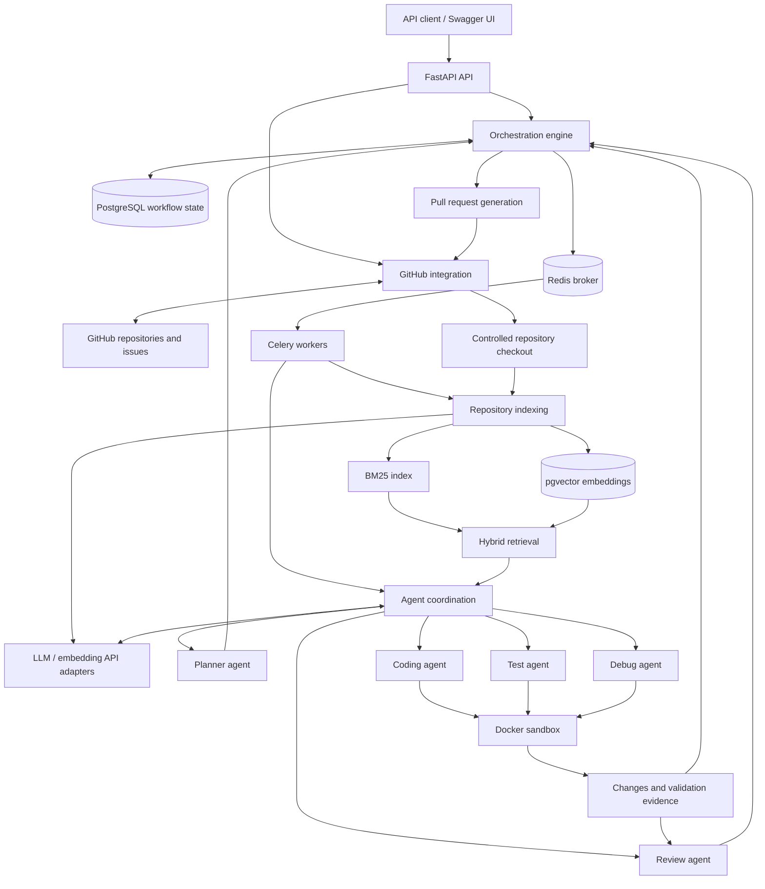

# AI Software Engineering Platform

> **Status: Python 3.12 scaffold and local infrastructure available; platform functionality PLANNED.** Development checks and Docker Compose services for PostgreSQL 16 with pgvector and Redis exist. No API application, agents, or platform integrations have been implemented. The workflows and architecture below describe the intended system.

An AI-powered, multi-agent software engineering platform intended to turn GitHub issues into review-ready pull requests. The planned system will understand a repository, retrieve relevant code with hybrid BM25/vector search, build dependency-aware implementation plans, distribute work to workers, and coordinate coding, testing, debugging, and review in isolated Docker environments.

**The first version is planned to be backend/API focused.** FastAPI-generated Swagger UI and OpenAPI documentation will provide the API exploration interface; a frontend will not be required.

## Core goals — PLANNED

- Ground proposed changes in the issue requirements and the repository's actual code and conventions.
- Combine lexical BM25 search with semantic vector search to retrieve useful implementation context.
- Produce explicit task dependencies and dispatch work only when prerequisites are satisfied.
- Coordinate specialized agents through a durable, observable orchestration workflow.
- Validate generated changes in isolated containers and attempt bounded recovery when checks fail.
- Produce a review-ready GitHub pull request with a clear change summary and validation evidence.
- Keep external integrations replaceable and mockable, with no real service required for unit tests.

## Technology target — PLANNED

| Technology | Intended role |
| --- | --- |
| Python | Backend, agents, indexing, and orchestration |
| FastAPI | HTTP API and generated Swagger/OpenAPI documentation |
| PostgreSQL | Persistent workflow, repository, task, and execution records |
| pgvector | PostgreSQL extension for embedding storage and vector similarity search |
| Redis | Celery message broker and transient coordination/cache data |
| Celery | Background task execution and worker queues |
| Docker | Local service packaging and isolated validation environments |
| LLM APIs | Model-backed planning, coding, debugging, review, and embeddings through provider abstractions |

## Planned workflow

1. **Receive an issue:** accept an authorized GitHub repository and issue reference through the API.
2. **Prepare repository context:** obtain a controlled checkout at a recorded revision and inspect relevant repository instructions and configuration.
3. **Index the repository:** extract code and metadata, prepare a BM25 index, and generate embeddings for storage in pgvector.
4. **Retrieve context:** combine lexical and vector results, deduplicate candidates, and assemble relevant context with file and revision references.
5. **Plan implementation:** create tasks, dependencies, acceptance criteria, and validation requirements from the issue and retrieved context.
6. **Dispatch ready tasks:** use the orchestration engine to enqueue eligible work for Celery workers while tracking state and avoiding conflicting writes.
7. **Generate changes:** have coding agents implement assigned tasks in controlled workspaces.
8. **Validate in isolation:** have test agents run applicable tests, linting, and type checks inside Docker sandboxes and record outputs and exit codes.
9. **Attempt recovery:** on failure, have debug agents analyze evidence and propose fixes, then repeat validation within configured attempt and resource limits. Exhausted recovery must surface an explicit failure or request for human intervention.
10. **Review changes:** have review agents assess correctness, scope, security, and consistency with the plan and validation evidence.
11. **Prepare a pull request:** publish an authorized branch and open a review-ready GitHub pull request with a summary, test results, and known limitations. Human review remains part of the intended process; automatic merging is outside the initial scope.

## Planned architecture

This diagram describes the planned platform. Local PostgreSQL/pgvector and Redis infrastructure exists; application components and their connections remain planned.



pgvector is enabled as an extension within local PostgreSQL, not as a separate database service. Planned agent roles are logical components executed by workers, not necessarily separate services. The orchestration engine will own workflow state and retry decisions; Redis will not be the authoritative store for durable workflow records.

## Main components — PLANNED

| Component | Intended responsibility |
| --- | --- |
| FastAPI API | Validate requests, expose workflow status and results, and provide Swagger/OpenAPI documentation. |
| PostgreSQL | Persist repository metadata, plans, task dependencies, run state, and validation records. |
| pgvector | Store code embeddings and support similarity queries tied to repository revisions. |
| Redis | Broker queued work and support transient caching or coordination where needed. |
| Celery workers | Execute indexing, agent, and validation jobs with explicit failure reporting. |
| Repository indexing | Extract and chunk relevant repository content while recording paths, revisions, and exclusions. |
| BM25 retrieval | Find lexical matches for identifiers, error messages, and code terminology. |
| Vector retrieval | Find semantically related code using embeddings behind a provider interface. |
| Hybrid retrieval | Fuse BM25 and vector candidates, deduplicate results, and select context within a budget. |
| GitHub integration | Access authorized issues and repositories and manage branches and pull requests through an abstracted client. |
| Planner agent | Translate requirements and repository context into dependency-aware implementation tasks. |
| Coding agent | Generate focused changes that follow repository instructions and task boundaries. |
| Test agent | Identify and run applicable checks and preserve genuine validation evidence. |
| Debug agent | Analyze failures and attempt scoped repairs within a bounded recovery policy. |
| Review agent | Evaluate changes and evidence against acceptance criteria and report unresolved concerns. |
| Orchestration engine | Manage task dependencies, durable state transitions, dispatch, cancellation, and recovery limits. |
| Docker sandbox | Execute generated code and checks with constrained resources, access, and lifetime. |
| Pull request generation | Prepare an authorized branch and pull request with traceable changes, validation results, and limitations. |

## Project directory structure

The following scaffold exists. Package initializers contain docstrings only; component responsibilities remain planned. `.gitkeep` files preserve empty directories in Git.

```text
.
├── README.md
├── .gitignore
├── .env.example              # Development defaults and future placeholders
├── compose.yaml              # PostgreSQL/pgvector and Redis only
├── docker/
│   └── postgres/
│       └── init.sql          # Enables vector in a new database
├── pyproject.toml            # Python 3.12, dependencies, test/lint/type settings
├── app/                     # Installable application package
│   ├── __init__.py
│   ├── api/
│   ├── core/
│   ├── db/
│   ├── models/
│   ├── schemas/
│   ├── services/
│   ├── integrations/
│   │   ├── github/
│   │   └── llm/
│   ├── indexing/
│   ├── retrieval/
│   ├── agents/
│   ├── orchestration/
│   ├── workers/
│   ├── sandbox/
│   └── pull_requests/
├── tests/
│   ├── unit/
│   │   └── test_imports.py
│   └── integration/
│       └── test_infrastructure.py  # Opt-in checks against running services
├── scripts/                 # Empty
└── docs/                    # Empty
```

Each directory under `app/` contains an `__init__.py`. Database migrations and application containers remain planned. Compose currently runs only PostgreSQL/pgvector and Redis.

## Development roadmap — PLANNED

The phases below indicate intended sequencing, not completed capabilities or permission to implement additional steps.

1. **Project documentation:** initial README available.
2. **Backend foundation (partial):** Python 3.12 scaffold, dependency declarations, and automated import/lint/type checks are available. A FastAPI application, typed settings, and logging remain planned.
3. **Persistence and background execution (partial):** local PostgreSQL 16/pgvector and Redis Compose services are available. Database models, migrations, and Celery execution remain planned.
4. **Repository access:** add a mockable GitHub integration and controlled repository acquisition.
5. **Indexing and retrieval:** implement repository indexing, BM25, embeddings, pgvector queries, and hybrid retrieval evaluation.
6. **Planning and orchestration:** implement dependency-aware plans, persisted task state, and worker dispatch.
7. **Coding and isolated validation:** add coding/test agents and the Docker sandbox execution interface.
8. **Recovery and review:** add bounded debugging loops and review-agent feedback with explicit failure states.
9. **Pull request delivery:** integrate branch publication and review-ready pull request generation.
10. **Hardening:** validate security boundaries, reliability, observability, and end-to-end behavior.

## Security considerations — PLANNED

- **Secrets:** load credentials from environment variables or a future secret manager. Keep real credentials out of source control, example configuration, logs, tests, model prompts, and pull requests. `.env.example` contains public development-only defaults and empty placeholders, never real secrets.
- **Least privilege:** restrict GitHub credentials to the required repositories and operations. Define API authentication, authorization, and repository access controls before exposing the service.
- **Untrusted inputs:** treat issue text, repository content, model output, and generated code as untrusted. Repository instructions must not override platform security policy or authorize credential disclosure and unrelated actions.
- **Container boundaries:** use non-root execution, resource and time limits, restricted networking, and narrow filesystem mounts. Do not expose host secrets or the Docker socket to generated-code containers. Docker isolation requires hardening and is not a complete security boundary by itself.
- **Data handling:** exclude secrets and sensitive files from indexing and embedding requests. Define what repository content may be sent to external LLM providers and establish retention and cleanup policies.
- **Controlled execution:** validate paths and execution parameters, prevent access outside assigned workspaces, and record commands, exit codes, and relevant artifacts without leaking sensitive data.
- **Bounded automation:** cap retries, execution time, and model usage. Report exhausted recovery and failed checks explicitly rather than silently proceeding.
- **Traceability:** tie changes and retrieval results to repository revisions and retain enough evidence for human review. Publishing permissions and policy must be explicit before external writes are enabled.

Platform security controls remain planned. Local infrastructure publishes ports only on loopback and uses development-only configuration; it is not a production deployment.

## Local scaffold development

Use **Python 3.12.x**. The project uses a consistent `app/` package layout and an editable installation. Runtime dependencies are declared for FastAPI, uvicorn, SQLAlchemy, psycopg (with binary support), Alembic, pydantic-settings, Redis, Celery, and httpx. Development dependencies provide pytest, pytest-asyncio, Ruff, and mypy.

From the repository root in PowerShell:

```powershell
# Create the environment only if it does not already exist.
py -3.12 -m venv .venv
.\.venv\Scripts\python.exe -m pip install -e ".[dev]"
.\.venv\Scripts\python.exe -m pytest --collect-only -q
.\.venv\Scripts\python.exe -m pytest
.\.venv\Scripts\python.exe -m ruff check .
.\.venv\Scripts\python.exe -m ruff format --check .
.\.venv\Scripts\python.exe -m mypy
.\.venv\Scripts\python.exe -m pip check
```

On POSIX systems, create the environment with `python3.12 -m venv .venv` and use `.venv/bin/python` for the remaining commands. Activation is optional when invoking the environment's interpreter directly.

The import smoke test exercises the scaffold packages without credentials or running services. Ruff checks formatting, imports, and common Python errors; mypy uses strict checking for application packages and tests. Dependency ranges are declared, but a reproducible lockfile is not yet provided.

The default test run skips opt-in infrastructure tests; no `.env`, Docker, running service, or API key is required for the import tests. Compose consumes infrastructure settings; Python application settings are not implemented yet. Future generated repository checkouts should live under the ignored `workspaces/` directory; any alternative location will need its own exclusion policy.

**PLANNED:** database migrations, API routes, workers, and platform integration tests. There is no server entry point or runnable Swagger UI yet. The first version will use FastAPI Swagger/OpenAPI documentation without requiring a frontend. External-service interfaces and test doubles will be introduced alongside the corresponding integrations.

## Local infrastructure

Docker Desktop must be running in **Linux containers** mode with Docker Compose v2. Verify with `docker version` (both Client and Server sections), `docker compose version` (v2), and `docker info --format '{{.OSType}}'` (`linux`). If Docker is unavailable, install/start Docker Desktop and resolve its startup errors before continuing.

From the repository root:

```powershell
docker compose config --quiet
docker compose up -d --wait --wait-timeout 180
docker compose ps
```

Both `postgres` and `redis` should report **healthy**. The defaults work without a `.env` file. To customize them, copy `.env.example` to `.env` only if `.env` does not already exist, then edit it locally. Never commit `.env`. Shell variables take precedence over `.env`. Prefer `config --quiet` because full rendered configuration can expose passwords.

- PostgreSQL uses the [pgvector project's image](https://github.com/pgvector/pgvector#docker), `pgvector/pgvector:pg16`. A read-only initialization SQL file enables `vector` in `POSTGRES_DB` on the first startup of an empty data volume. No package installation occurs at runtime.
- Redis uses `redis:7.4-alpine` with [AOF persistence](https://redis.io/docs/latest/operate/oss_and_stack/management/persistence/) and `appendfsync everysec`. Both services have healthchecks and separate named volumes.
- Published ports bind only to `127.0.0.1`. The public sample database password is for local development only. Redis has no authentication and must remain local; other containers on the Compose network can access both services.
- No FastAPI or Celery container is defined. These data services are not the future untrusted-code sandbox.

Verify service behavior, including an authenticated PostgreSQL query and pgvector operation:

```powershell
$env:RUN_INFRASTRUCTURE_TESTS = '1'
.\.venv\Scripts\python.exe -m pytest tests/integration/test_infrastructure.py -v
Remove-Item Env:RUN_INFRASTRUCTURE_TESTS
docker compose exec -T redis redis-cli ping
```

Expected: two passing integration tests and `PONG`. Tests are read-only and require services to be started explicitly; they do not create or remove containers.

### Host and future container connections

| Caller | PostgreSQL address | Redis address |
| --- | --- | --- |
| Local Python process | `127.0.0.1:5432` (or `POSTGRES_PORT`) | `127.0.0.1:6379` (or `REDIS_PORT`) |
| Future service on the same Compose network | `postgres:5432` | `redis:6379` |

`.env.example` supplies host-side URL samples. Future application containers must override `DATABASE_URL` to use `postgres:5432` and Redis URLs to use `redis:6379`; `localhost` inside a container refers to that container. Host port overrides do not change internal service ports. Keep database name, username, password, and URLs consistent when customizing; URL-encode special characters in URL credentials. URL values in the example are explicit samples and do not automatically track changes to `POSTGRES_*`.

### Stop, restart, and persistence

```powershell
docker compose stop
docker compose up -d --wait --wait-timeout 180
# Remove containers and network while keeping database/Redis volumes:
docker compose down
```

Named volumes survive container removal and recreation. Do not use `docker compose down --volumes` unless you intentionally want to delete all local database and Redis data. PostgreSQL initialization variables and `init.sql` apply only to a fresh volume: changing `.env` does not change existing database credentials or rerun initialization. Existing databases require an explicit credential/database update; do not erase their volume as a routine configuration fix.

If host ports are occupied, set unused `POSTGRES_PORT` / `REDIS_PORT` values locally and update host-side URLs. Inspect health failures with `docker compose ps` and `docker compose logs postgres redis`; avoid sharing logs that contain sensitive information. Image tags track their major release lines rather than immutable digests. AOF every-second syncing can lose roughly a second of recent writes after a crash; this setup is development infrastructure, not a backup solution.

## Environment variables

Compose currently consumes the five infrastructure variables below, with development defaults. URL samples are provided for future application clients; all other application settings remain provisional and unused. No real credentials are included.

| Variable name | Intended purpose |
| --- | --- |
| `POSTGRES_DB` | Initial database name; defaults to `platform_dev` |
| `POSTGRES_USER` | Initial development database superuser; defaults to `platform_dev` |
| `POSTGRES_PASSWORD` | Initial password; public local-development-only default |
| `POSTGRES_PORT` | Loopback host port; defaults to `5432` |
| `REDIS_PORT` | Loopback host port; defaults to `6379` |
| `APP_ENV` | Runtime environment selection |
| `LOG_LEVEL` | Application logging verbosity |
| `API_HOST` | API bind address |
| `API_PORT` | API listening port |
| `DATABASE_URL` | PostgreSQL connection configuration; may contain credentials |
| `REDIS_URL` | Redis connection configuration; may contain credentials |
| `CELERY_BROKER_URL` | Celery broker connection configuration |
| `CELERY_RESULT_BACKEND` | Celery result backend configuration, if used |
| `GITHUB_TOKEN` | GitHub authentication credential for the selected token-based approach |
| `GITHUB_API_URL` | GitHub API endpoint configuration |
| `LLM_PROVIDER` | Selected LLM provider adapter |
| `LLM_API_KEY` | LLM provider credential |
| `LLM_MODEL` | Model identifier for agent requests |
| `LLM_BASE_URL` | Provider endpoint override, if supported |
| `EMBEDDING_PROVIDER` | Selected embedding provider adapter |
| `EMBEDDING_API_KEY` | Embedding provider credential, if separately required |
| `EMBEDDING_MODEL` | Model identifier for code embeddings |
| `REPOSITORY_WORKSPACE_ROOT` | Configurable root for controlled checkouts |
| `SANDBOX_IMAGE` | Approved container image for validation |
| `SANDBOX_TIMEOUT_SECONDS` | Maximum duration of a sandbox execution |
| `SANDBOX_MEMORY_LIMIT` | Container memory limit |
| `SANDBOX_CPU_LIMIT` | Container CPU limit |
| `MAX_RECOVERY_ATTEMPTS` | Maximum automated repair attempts per configured recovery scope |

Credential values must be supplied locally through the appropriate environment variables or a future secret-management integration, never pasted into project documentation or committed to Git.

## Current project status

- **Present:** README, Python 3.12 package scaffold, dependency/tool configuration, `.gitignore`, development `.env.example`, package-import tests, PostgreSQL/pgvector and Redis Compose infrastructure, and opt-in infrastructure tests.
- **PLANNED:** all application functionality, APIs, agents, retrieval, database schemas, queues, external integrations, sandbox execution, and pull request generation.
- **Not yet created:** API application, business logic, platform integration implementations/tests, migrations, and application containers.
- **Initial interface target:** backend/API access with FastAPI Swagger/OpenAPI documentation; no frontend is required for the first version.

Implementation will proceed one explicitly requested step at a time.
