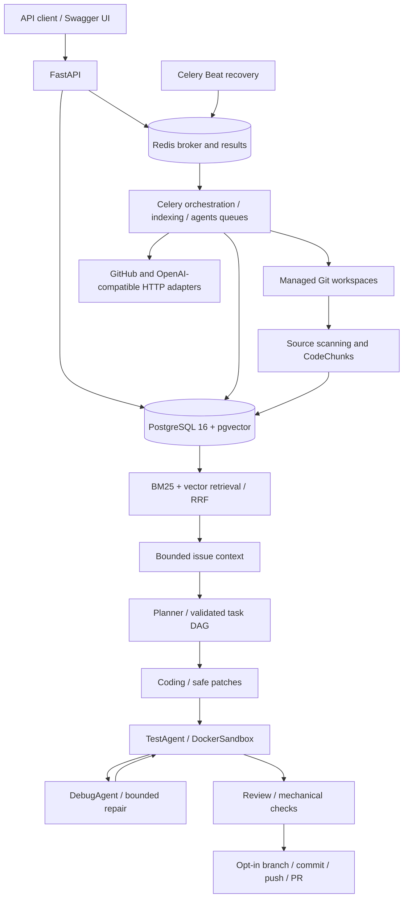

# AI Software Engineering Platform

A backend/API platform that turns a GitHub issue into a dependency-aware implementation plan, applies focused changes, tests them in isolated Docker containers, attempts bounded repairs, reviews the result, and optionally opens a GitHub pull request.

These stages are implemented. Automated acceptance uses real local PostgreSQL, Redis, Git and Docker with fake GitHub/LLM providers. Passing those tests does not establish that every real provider or repository will work without configuration. The interface is FastAPI Swagger UI at `/docs` and OpenAPI at `/openapi.json`; there is no frontend.

## Architecture and stack


```mermaid
flowchart TD
    Client[API client / Swagger UI] --> API[FastAPI]
    API --> DB[(PostgreSQL 16 + pgvector)]
    API --> Broker[(Redis broker and results)]
    Beat[Celery Beat recovery] --> Broker
    Broker --> Workers[Celery orchestration / indexing / agents queues]
    Workers --> DB
    Workers --> Git[Managed Git workspaces]
    Git --> Index[Source scanning and CodeChunks]
    Index --> DB
    DB --> Retrieval[BM25 + vector retrieval / RRF]
    Retrieval --> Context[Bounded issue context]
    Context --> Planner[Planner / validated task DAG]
    Planner --> Coding[Coding / safe patches]
    Coding --> Tests[TestAgent / DockerSandbox]
    Tests --> Debug[DebugAgent / bounded repair]
    Debug --> Tests
    Tests --> Review[Review / mechanical checks]
    Review --> PR[Opt-in branch / commit / push / PR]
    Workers --> Providers[GitHub and OpenAI-compatible HTTP adapters]
```

Python 3.12, FastAPI/uvicorn, Pydantic settings, SQLAlchemy 2/psycopg/Alembic, PostgreSQL 16/pgvector, Redis, Celery, httpx, Git and Docker are used. Docker sandbox control uses the Docker CLI. pytest, Ruff and mypy provide validation. No observability SaaS is required.

[Architecture](docs/architecture.md) explains retrieval, persistence, queues and state ownership. [Security](docs/security.md) describes controls and their limits.

## Implemented workflow

`POST /workflows` starts the full asynchronous path:

1. Register repository metadata, synchronize the default branch and record its revision.
2. Scan eligible files and reconcile deterministic CodeChunks; generate missing/stale embeddings.
3. Import the issue and retrieve bounded hybrid code context.
4. Generate a structured plan; validate unique task keys, references and an acyclic dependency graph before persistence.
5. Create the execution and its isolated workspace. Schedule tasks whose dependencies passed.
6. CodingAgent proposes a validated patch. TestAgent runs operator-approved commands in Docker.
7. Failed tests enter DebugAgent recovery, at most `MAX_RECOVERY_ATTEMPTS` times (default 3). Only passing required tests permit success.
8. ReviewAgent evaluates accumulated changes. Separate mechanical checks enforce task/test/review requirements.
9. If publication was enabled when the workflow was created, prepare a deterministic branch, commit, push and create/reconcile a PR; persist its record and return its URL.

Workflow progress and error history are durable. Celery Beat recovers pending dispatches and stale work. This is bounded, idempotent recovery where possible, not a guarantee of exactly-once external effects. See [reliability](docs/orchestration-reliability.md).

## From-zero local setup

Use the [development guide](docs/development.md) for prerequisites, Windows/Linux commands, provider setup and troubleshooting. The following PowerShell commands run from a checkout of this repository. Install Python **3.12**, Git and Docker Desktop with a running **Linux** engine first; no repository URL is hard-coded here.

```powershell
python --version
git --version
docker version
docker info --format '{{.OSType}}'
python -m venv .venv
.\.venv\Scripts\Activate.ps1
python -m pip install -e ".[dev]"
# First setup only: do not overwrite an existing .env.
if (!(Test-Path .env)) { Copy-Item .env.example .env }
docker compose config --quiet
docker compose up -d --wait --wait-timeout 180
docker compose ps
python -m alembic upgrade head
python -m alembic current
docker pull python:3.12-slim
```

Expected: Python 3.12.x, Docker client **and server**, `linux`, and healthy PostgreSQL/Redis containers. Alembic must finish at the current head. Docker Compose starts infrastructure only, not FastAPI or Celery. The trusted sandbox image is pre-pulled; sandbox runs never install packages over the network.

Run these in **three separate activated terminals at the repository root**:

```powershell
# API
python -m uvicorn app.main:create_app --factory --reload --host 127.0.0.1 --port 8000
```

```powershell
# Local worker; solo is for Windows development, not production time-limit enforcement.
python -m celery -A app.workers.celery_app:app worker --pool=solo --concurrency=1 -Q orchestration,indexing,agents --loglevel=INFO
```

```powershell
# One Beat scheduler per deployment
python -m celery -A app.workers.celery_app:app beat --loglevel=INFO
```

```powershell
Invoke-RestMethod http://127.0.0.1:8000/health
Invoke-RestMethod http://127.0.0.1:8000/ready
```

`/health` checks process liveness. `/ready` checks PostgreSQL and Redis, not provider credentials, migrations, worker availability or the sandbox image. Open `http://127.0.0.1:8000/docs` to inspect schemas and try APIs.

### PostgreSQL, pgvector and Redis

Compose uses `pgvector/pgvector:pg16` and `redis:7.4-alpine`, named persistent volumes, healthchecks and loopback-only host ports. Redis enables append-only persistence. Alembic creates application tables and enables pgvector; the initial vector column is **1536 dimensions**. Changing `EMBEDDING_DIM` alone does not resize it.

Host processes use `127.0.0.1`; processes placed in the same Compose network would use `postgres:5432` and `redis:6379`. Keep connection URLs consistent with credentials and published ports. `docker compose down` retains volumes; `docker compose down -v` destroys their data. Never run the latter as a routine restart. The default database password is strictly for local development.

## Configuration and credentials

Settings load `.env` relative to the working directory, with shell variables taking precedence. Empty optional values use defaults. Restart API/workers/Beat after changes. Never commit `.env` or put real credentials in commands, documentation or chat.

| Variables | Use |
| --- | --- |
| `APP_ENV`, `APP_NAME`, `LOG_LEVEL`, `DEPENDENCY_TIMEOUT_SECONDS` | Application identity, JSON logging and dependency probes |
| `POSTGRES_DB`, `POSTGRES_USER`, `POSTGRES_PASSWORD`, `POSTGRES_PORT`, `REDIS_PORT` | Compose infrastructure only |
| `DATABASE_URL`, `REDIS_URL` | PostgreSQL and readiness connections |
| `CELERY_BROKER_URL`, `CELERY_RESULT_BACKEND` | Worker broker/results; example uses Redis databases 1 and 2 |
| `GITHUB_TOKEN`, `GITHUB_API_URL`, `GITHUB_GIT_HOST` | GitHub HTTP and Git authentication/host policy |
| `GIT_COMMIT_NAME`, `GIT_COMMIT_EMAIL` | Commit attribution |
| `LLM_API_KEY`, `LLM_BASE_URL`, `LLM_MODEL` | OpenAI-compatible chat completions with structured JSON-schema output |
| `LLM_TIMEOUT_SECONDS`, `LLM_MAX_RETRIES`, `LLM_MAX_OUTPUT_TOKENS` | Provider bounds |
| `EMBEDDING_MODEL`, `EMBEDDING_DIM`, `EMBEDDING_BATCH_SIZE`, `EMBEDDING_MAX_RETRIES`, `EMBEDDING_TIMEOUT_SECONDS`, `EMBEDDING_SEND_DIMENSIONS` | Embeddings use the same `LLM_API_KEY` and `LLM_BASE_URL` |
| `WORKSPACE_ROOT`, `INDEX_MAX_FILE_BYTES`, `INDEX_CHUNK_MAX_LINES`, `INDEX_CHUNK_MAX_CHARS` | Checkout and scanning/chunk limits |
| `CONTEXT_MAX_ISSUE_CHARS`, `CONTEXT_MAX_CODE_CHARS`, `CONTEXT_MAX_CHUNKS`, `CONTEXT_MAX_FILES`, `CONTEXT_MAX_QUERIES`, `CONTEXT_QUERY_CHARS`, `CONTEXT_INCLUDE_NEIGHBORS` | Bounded issue context |
| `PLANNER_VALIDATION_RETRIES`, `MAX_RECOVERY_ATTEMPTS`, `REVIEW_MAX_INPUT_CHARS` | Agent validation/recovery bounds |
| `WORKFLOW_REQUIRED_TESTS`, `TEST_ALLOWED_COMMANDS` | Trusted required tests and exact command profiles |
| `ORCHESTRATION_RECOVERY_SECONDS`, `WORKFLOW_STAGE_ATTEMPTS`, `WORKFLOW_RETRY_SECONDS`, `EXECUTION_STALE_SECONDS` | Dispatch/retry/stale-run policy |
| `SANDBOX_IMAGES`, `SANDBOX_USER`, `SANDBOX_TIMEOUT_SECONDS`, `SANDBOX_MEMORY_MB`, `SANDBOX_CPU_LIMIT`, `SANDBOX_PID_LIMIT`, `SANDBOX_OUTPUT_BYTES` | Trusted image aliases and resource limits |
| `TEST_DATABASE_URL`, `RUN_DATABASE_TESTS`, `RUN_WORKER_TESTS`, `RUN_SANDBOX_TESTS`, `RUN_INFRASTRUCTURE_TESTS` | Opt-in tests; export test flags/URL in the shell |

[.env.example](.env.example) supplies safe defaults. Its legacy `API_HOST`, `API_PORT`, `LLM_PROVIDER`, `EMBEDDING_PROVIDER`, `EMBEDDING_API_KEY` and `REPOSITORY_WORKSPACE_ROOT` placeholders are **not consumed** by current Settings. Use uvicorn CLI flags, the supported adapters and `WORKSPACE_ROOT` instead.

Public repository/issue reads may work without a token, subject to GitHub limits. Private clones require Contents read; imports require repository metadata and Issues read. Publication additionally requires Contents write and Pull requests write. Configure a repository-scoped credential in `GITHUB_TOKEN`. Both agent calls and embeddings require a compatible provider configured locally. Neither is required for unit tests. See [manual provider setup](docs/development.md#github-and-llm-setup).

## Use the API

Examples below assume the API and workers are running and provider configuration is ready where required. Replace owner/name with a repository you are authorized to use. Real workflow execution sends source context to the configured provider and may incur charges.

### Full workflow and optional PR

```powershell
$api = 'http://127.0.0.1:8000'
$owner = Read-Host 'GitHub owner'
$name = Read-Host 'GitHub repository name'
$issueNumber = [int](Read-Host 'Issue number')
$workflowRequest = @{
    request_id = [guid]::NewGuid().ToString()
    github_owner = $owner
    github_name = $name
    issue_number = $issueNumber
    publish_pull_request = $false
}
$workflow = Invoke-RestMethod -Method Post -Uri "$api/workflows" -ContentType 'application/json' -Body ($workflowRequest | ConvertTo-Json)
Invoke-RestMethod "$api/workflows/$($workflow.id)"
```

Keep the same `request_id` and payload when retrying submission. A changed payload with that ID returns 409. Set `publish_pull_request = $true` **before first submission** only when you intend to create a real remote branch/PR. Publication cannot be enabled later by changing an existing request. There is no standalone public PR-creation endpoint or automatic merge.

Poll `GET /workflows/{workflow_id}` for stage, status, attempts, error code, history and generated IDs. Once `execution_id` is present, `GET /executions/{execution_id}` returns task states, dependency metadata, attempts, summaries, elapsed time and counts. A completed execution alone does not mean review/publication succeeded; check the workflow's final status and `pull_request_url`.

`POST /workflows/{id}/resume` retries eligible failed stages within the attempt budget. `POST /workflows/{id}/cancel` and `POST /executions/{id}/cancel` cancel at safe boundaries; active work can return 409. Do not blindly resubmit blocked or ambiguous external operations.

### Individual preparation and planning

```powershell
$repository = Invoke-RestMethod -Method Post -Uri "$api/repositories" -ContentType 'application/json' -Body (@{github_owner=$owner; github_name=$name} | ConvertTo-Json)
Invoke-RestMethod "$api/repositories/$($repository.id)"
```

Prepare, index and embed through the actual Celery tasks below. **There are no `/sync`, `/index` or `/embed` HTTP routes.** In an activated Python REPL, substitute the registered UUID and wait for each task to succeed:

```python
from app.workers.celery_app import app

repository_id = input("Registered repository UUID: ").strip()
for task_name in ("repository.prepare_workspace", "repository.index_code", "repository.embed_code"):
    task = app.send_task(task_name, args=[repository_id])
    print(task.id)
    print(task.get(timeout=1000))
```

Source indexing requires no model; omit the embedding task if testing BM25 only. The repository API exposes local/index/embedding status. `GET /worker-deliveries/{delivery_id}` exposes durable standalone delivery status, using the Celery task UUID after it is claimed.

```powershell
$issue = Invoke-RestMethod -Method Post -Uri "$api/repositories/$($repository.id)/issues/$issueNumber/import"
Invoke-RestMethod "$api/issues/$($issue.id)"
Invoke-RestMethod -Method Post -Uri "$api/repositories/$($repository.id)/search/bm25" -ContentType 'application/json' -Body (@{query='user lookup'; top_k=5} | ConvertTo-Json)
# Hybrid context and planning need embeddings/provider configuration:
Invoke-RestMethod "$api/issues/$($issue.id)/context"
$plan = Invoke-RestMethod -Method Post -Uri "$api/issues/$($issue.id)/plan"
Invoke-RestMethod "$api/plans/$($plan.id)"
$execution = Invoke-RestMethod -Method Post -Uri "$api/plans/$($plan.id)/executions"
Invoke-RestMethod "$api/executions/$($execution.id)"
```

The standalone execution endpoint creates/reconciles scheduling state; it does **not** dispatch coding, testing, review or publication. Use `/workflows` for the complete path, which creates its own plan and execution. Direct plan generation is an awaited HTTP operation; full-workflow planning is asynchronous. Repeated direct planning/execution requests can create new records.

Search routes are POST `/repositories/{id}/search/bm25`, `/search/vector`, and `/search` (hybrid), with `query` and `top_k`. Diagnostic queue checks use POST `/tasks/ping` and GET `/tasks/{task_id}`.

## Directory structure

```text
app/
  api/              HTTP routes and correlation middleware
  core/             Settings, JSON logging and timing
  db/ models/       Sessions and SQLAlchemy persistence
  schemas/          Pydantic API and agent contracts
  services/         Context, workspaces, agent records and domain services
  integrations/     Git, GitHub and LLM/embedding adapters
  indexing/         Scanning, chunking and embedding persistence
  retrieval/        BM25, cosine vector retrieval and RRF
  agents/           Planner, coding, test policy, debug and review logic
  orchestration/    DAG scheduling, transitions and durable workflow stages
  workers/          Celery application and task entry points
  sandbox/          Restricted Docker command execution
  pull_requests/    Publication checks, Git and PR reconciliation
migrations/         Alembic environment and revisions
docker/postgres/    Fresh-volume pgvector initialization
tests/
  unit/ integration/ e2e/
docs/               Architecture, development, security, tests and operations
scripts/            Reserved utility directory
.github/workflows/  CI
compose.yaml        Local PostgreSQL/Redis only
```

## Testing and CI

```powershell
python -m pytest tests/unit -q
python -m pytest -q
python -m ruff check .
python -m ruff format --check .
python -m mypy
```

Default test discovery skips service tests unless enabled. [Testing guide](docs/testing.md) gives exact integration/end-to-end/all-test commands and the coverage map. CI is configured for push/pull requests with Python 3.12, lint/type checks, local services and fake providers. A configured workflow is not a claim that the latest GitHub-hosted run passed.

## Security and known limitations

* No built-in API authentication, tenant authorization, rate limiting or production deployment packaging. Keep the API local; secure access externally before exposing it.
* Docker restrictions reduce risk but are not a complete boundary for hostile multi-tenant execution. The worker's Docker access is powerful; use dedicated hosts and trusted images.
* Default sandbox image contains Python/unittest, not pytest or Node/Go/Rust tools. Dependencies must already exist in a reviewed image. Default unittest discovery may find zero tests; operators must choose meaningful required commands.
* The production workflow serializes tasks within one execution's shared workspace, even when the DAG has independent tasks. Different executions can use different workers.
* BM25 reads repository chunks into memory per search. Vector retrieval uses pgvector cosine queries; no approximate-nearest-neighbor index is configured. Large repositories need further scaling work.
* The scanner uses explicit exclusions, not `.gitignore`, and cannot guarantee detection of every secret. Context limits are character counts, not token/cost budgets. Repository text can contain prompt injection.
* Provider outages, changed source revisions, stale workspace locks and ambiguous side effects can require inspection. Cancellation is not process termination or rollback of remote publication.
* Passing tests and model approval are evidence, not proof of correctness. No automatic merge, general dependency installation, submodule/LFS content support, or automatic workspace-retention cleanup is provided.

See [security](docs/security.md), [reliability](docs/orchestration-reliability.md), and [observability](docs/observability.md) before operating against real repositories.
