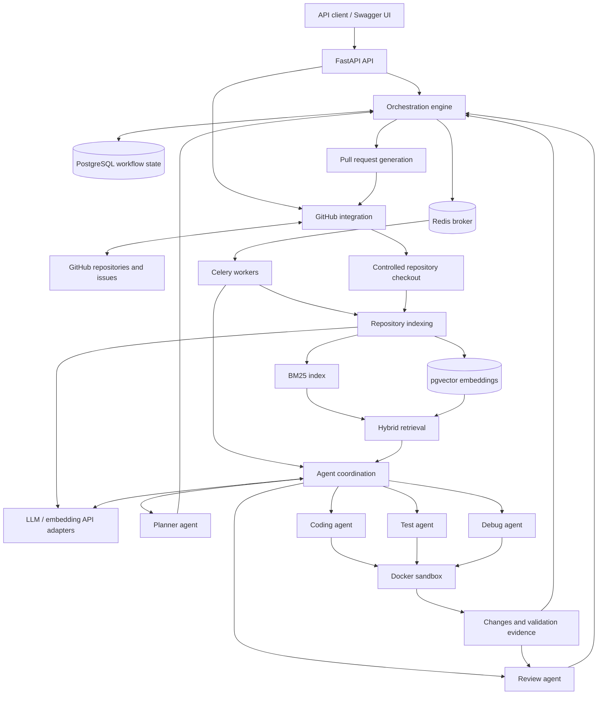

# AI Software Engineering Platform

> **Status: API, persistence, Celery tasks, GitHub imports, workspaces, indexing, hybrid retrieval, issue context, draft planning, execution state, Docker sandbox, and explicit coding proposals/patch application available.** Coding does not automatically run through workers or complete tasks. Test/debug/review agents and the complete issue-to-pull-request workflow remain PLANNED.

An AI-powered, multi-agent software engineering platform intended to turn GitHub issues into review-ready pull requests. The planned system will understand a repository, retrieve relevant code with hybrid BM25/vector search, build dependency-aware implementation plans, distribute work to workers, and coordinate coding, testing, debugging, and review in isolated Docker environments.

**The first version is backend/API focused.** FastAPI-generated Swagger UI and OpenAPI documentation provide the API exploration interface; a frontend is not required.

## Core goals — PLANNED

- Ground proposed changes in the issue requirements and the repository's actual code and conventions.
- Combine lexical BM25 search with semantic vector search to retrieve useful implementation context.
- Produce explicit task dependencies and dispatch work only when prerequisites are satisfied.
- Coordinate specialized agents through a durable, observable orchestration workflow.
- Validate generated changes in isolated containers and attempt bounded recovery when checks fail.
- Produce a review-ready GitHub pull request with a clear change summary and validation evidence.
- Keep external integrations replaceable and mockable, with no real service required for unit tests.

## Technology target — PLANNED

| Technology | Intended role |
| --- | --- |
| Python | Backend, agents, indexing, and orchestration |
| FastAPI | HTTP API and generated Swagger/OpenAPI documentation |
| PostgreSQL | Persistent workflow, repository, task, and execution records |
| pgvector | PostgreSQL extension for embedding storage and vector similarity search |
| Redis | Celery message broker and transient coordination/cache data |
| Celery | Background task execution and worker queues |
| Docker | Local service packaging and isolated validation environments |
| LLM APIs | Model-backed planning, coding, debugging, review, and embeddings through provider abstractions |

## Planned workflow

1. **Receive an issue:** accept an authorized GitHub repository and issue reference through the API.
2. **Prepare repository context:** obtain a controlled checkout at a recorded revision and inspect relevant repository instructions and configuration.
3. **Index the repository:** extract code and metadata, prepare a BM25 index, and generate embeddings for storage in pgvector.
4. **Retrieve context:** combine lexical and vector results, deduplicate candidates, and assemble relevant context with file and revision references.
5. **Plan implementation:** create tasks, dependencies, acceptance criteria, and validation requirements from the issue and retrieved context.
6. **Dispatch ready tasks:** use the orchestration engine to enqueue eligible work for Celery workers while tracking state and avoiding conflicting writes.
7. **Generate changes:** have coding agents implement assigned tasks in controlled workspaces.
8. **Validate in isolation:** have test agents run applicable tests, linting, and type checks inside Docker sandboxes and record outputs and exit codes.
9. **Attempt recovery:** on failure, have debug agents analyze evidence and propose fixes, then repeat validation within configured attempt and resource limits. Exhausted recovery must surface an explicit failure or request for human intervention.
10. **Review changes:** have review agents assess correctness, scope, security, and consistency with the plan and validation evidence.
11. **Prepare a pull request:** publish an authorized branch and open a review-ready GitHub pull request with a summary, test results, and known limitations. Human review remains part of the intended process; automatic merging is outside the initial scope.

## Planned architecture

This diagram describes the planned platform. The API, infrastructure, GitHub imports, workspaces, chunk persistence, BM25, vector, and hybrid retrieval exist. Orchestration, agents, and the complete external workflow remain planned.


```mermaid
flowchart TD
    Client[API client / Swagger UI] --> API[FastAPI API]
    API --> Orchestrator[Orchestration engine]
    API --> GitHub[GitHub integration]
    GitHub <--> Remote[GitHub repositories and issues]
    Orchestrator <--> DB[(PostgreSQL workflow state)]
    Orchestrator --> Redis[(Redis broker)]
    Redis --> Workers[Celery workers]
    Workers --> Indexer[Repository indexing]
    GitHub --> Checkout[Controlled repository checkout]
    Checkout --> Indexer
    Indexer --> BM25[BM25 index]
    Indexer --> Vectors[(pgvector embeddings)]
    Indexer --> Models[LLM / embedding API adapters]
    BM25 --> Retrieval[Hybrid retrieval]
    Vectors --> Retrieval
    Workers --> Agents[Agent coordination]
    Retrieval --> Agents
    Agents --> Planner[Planner agent]
    Agents --> Coding[Coding agent]
    Agents --> Test[Test agent]
    Agents --> Debug[Debug agent]
    Agents --> Review[Review agent]
    Agents <--> Models
    Planner --> Orchestrator
    Coding --> Sandbox[Docker sandbox]
    Test --> Sandbox
    Debug --> Sandbox
    Sandbox --> Evidence[Changes and validation evidence]
    Evidence --> Review
    Evidence --> Orchestrator
    Review --> Orchestrator
    Orchestrator --> PR[Pull request generation]
    PR --> GitHub
```

pgvector is enabled as an extension within local PostgreSQL, not as a separate database service. Planned agent roles are logical components executed by workers, not necessarily separate services. The orchestration engine will own workflow state and retry decisions; Redis will not be the authoritative store for durable workflow records.

## Main components — PLANNED

| Component | Intended responsibility |
| --- | --- |
| FastAPI API | Validate requests, expose workflow status and results, and provide Swagger/OpenAPI documentation. |
| PostgreSQL | Persist repository metadata, plans, task dependencies, run state, and validation records. |
| pgvector | Store code embeddings and support similarity queries tied to repository revisions. |
| Redis | Broker queued work and support transient caching or coordination where needed. |
| Celery workers | Execute indexing, agent, and validation jobs with explicit failure reporting. |
| Repository indexing | Extract and chunk relevant repository content while recording paths, revisions, and exclusions. |
| BM25 retrieval | Find lexical matches for identifiers, error messages, and code terminology. |
| Vector retrieval | Find semantically related code using embeddings behind a provider interface. |
| Hybrid retrieval | Fuse BM25 and vector candidates, deduplicate results, and select context within a budget. |
| GitHub integration | Access authorized issues and repositories and manage branches and pull requests through an abstracted client. |
| Planner agent | Translate requirements and repository context into dependency-aware implementation tasks. |
| Coding agent | Generate focused changes that follow repository instructions and task boundaries. |
| Test agent | Identify and run applicable checks and preserve genuine validation evidence. |
| Debug agent | Analyze failures and attempt scoped repairs within a bounded recovery policy. |
| Review agent | Evaluate changes and evidence against acceptance criteria and report unresolved concerns. |
| Orchestration engine | Manage task dependencies, durable state transitions, dispatch, cancellation, and recovery limits. |
| Docker sandbox | Execute generated code and checks with constrained resources, access, and lifetime. |
| Pull request generation | Prepare an authorized branch and pull request with traceable changes, validation results, and limitations. |

## Project directory structure

The following structure exists. Most component packages remain placeholders; health checks, configuration, persistence, diagnostic workers, and repository/issue imports are implemented. `.gitkeep` files preserve empty directories in Git.

```text
.
├── README.md
├── .gitignore
├── .env.example              # Development defaults and future placeholders
├── compose.yaml              # PostgreSQL/pgvector and Redis only
├── alembic.ini               # Migration configuration; no credentials
├── migrations/
│   ├── env.py                # Settings-backed migration runner
│   ├── script.py.mako
│   └── versions/
│       ├── 0001_initial_persistence_schema.py
│       ├── 0002_embedding_state.py
│       └── 0003_plan_proposal_fields.py
├── docker/
│   └── postgres/
│       └── init.sql          # Enables vector in a new database
├── pyproject.toml            # Python 3.12, dependencies, test/lint/type settings
├── app/                     # Installable application package
│   ├── __init__.py
│   ├── main.py              # FastAPI factory and lifespan
│   ├── api/
│   │   ├── status.py        # /health and /ready with response schemas
│   │   ├── tasks.py         # Diagnostic task submission/status
│   │   └── repositories.py  # Repository and issue import/read routes
│   ├── core/
│   │   └── config.py        # Centralized pydantic-settings configuration
│   ├── db/
│   │   ├── base.py          # UUID and timestamp conventions
│   │   └── session.py       # Engine and transactional sessions
│   ├── models/
│   │   ├── repository.py   # Repository, Issue, CodeChunk
│   │   ├── planning.py     # ImplementationPlan, PlanTask
│   │   └── execution.py    # ExecutionRun, TaskExecution, AgentRun, PullRequest
│   ├── schemas/
│   │   ├── tasks.py         # Diagnostic task response contracts
│   │   └── repositories.py  # Repository and issue response contracts
│   ├── services/
│   │   ├── readiness.py     # Mockable dependency probes and resource cleanup
│   │   ├── task_queue.py    # Mockable queue interface and Celery adapter
│   │   ├── repositories.py  # Transactional repository/issue imports
│   │   └── github_resources.py # Lifespan-owned HTTP and database resources
│   ├── integrations/
│   │   ├── github/
│   │   │   └── client.py    # GitHubClient protocol and httpx adapter
│   │   └── llm/
│   │       ├── embeddings.py        # EmbeddingProvider and validation
│   │       ├── openai_embeddings.py # Production HTTP adapter
│   │       └── fake_embeddings.py   # Deterministic test provider
│   ├── indexing/
│   │   ├── scanner.py       # Bounded source scanning and exclusions
│   │   ├── chunking.py      # Deterministic line/function-aware chunks
│   │   ├── embeddings.py    # Resumable vector generation
│   │   └── service.py       # Atomic CodeChunk reconciliation
│   ├── retrieval/
│   │   ├── base.py          # Retriever/ChunkSource interfaces
│   │   ├── tokenization.py  # Identifier and path normalization
│   │   ├── bm25.py          # BM25 ranking
│   │   ├── hybrid.py        # Default retrieval using reciprocal rank fusion
│   │   ├── vector.py        # Exact pgvector cosine retrieval
│   │   └── postgres.py      # Repository-scoped chunk loading
│   ├── agents/
│   │   └── planner.py       # Structured draft planning with bounded validation repair
│   ├── orchestration/
│   ├── workers/
│   │   ├── celery_app.py    # Worker CLI entry point
│   │   ├── factory.py       # Settings-backed Celery configuration
│   │   ├── embeddings.py    # repository.embed_code on indexing queue
│   │   └── tasks.py         # system.ping only
│   ├── sandbox/
│   └── pull_requests/
├── tests/
│   ├── unit/
│   │   ├── test_imports.py
│   │   ├── test_application.py
│   │   ├── test_session.py
│   │   ├── test_workers.py
│   │   └── test_github.py
│   └── integration/
│       ├── test_database.py # Isolated PostgreSQL migration/ORM tests
│       ├── test_infrastructure.py  # Opt-in checks against running services
│       └── test_worker.py   # Opt-in real Redis/Celery/API test
├── scripts/                 # Empty
└── docs/                    # Empty
```

Each directory under `app/` contains an `__init__.py`. The initial database migration is available; application containers remain planned. Compose currently runs only PostgreSQL/pgvector and Redis.

## Development roadmap — PLANNED

The phases below indicate intended sequencing, not completed capabilities or permission to implement additional steps.

1. **Project documentation:** initial README available.
2. **Backend foundation:** Python 3.12 scaffold, typed settings, minimal FastAPI endpoints, lifespan management, and automated tests/lint/type checks are available. Broader application behavior remains planned.
3. **Persistence and background execution (partial):** local PostgreSQL/pgvector and Redis, nine models, migrations, and Celery diagnostic execution are available. Business task execution remains planned.
4. **Repository access:** mockable GitHub REST adapter, repository/issue imports, and managed repository checkout are available.
5. **Indexing and retrieval (partial):** source scanning, deterministic chunking, CodeChunk persistence, and BM25 search are available. Batched embeddings and pgvector cosine search are available. Hybrid retrieval now combines both rankings with RRF.
6. **Planning and orchestration (partial):** LLM-backed draft planning, validated proposals, DAG ordering, and atomic plan/task persistence exist. Scheduling, execution, and worker dispatch remain planned.
7. **Coding and isolated validation:** add coding/test agents and the Docker sandbox execution interface.
8. **Recovery and review:** add bounded debugging loops and review-agent feedback with explicit failure states.
9. **Pull request delivery:** integrate branch publication and review-ready pull request generation.
10. **Hardening:** validate security boundaries, reliability, observability, and end-to-end behavior.

## Security considerations — PLANNED

- **Secrets:** load credentials from environment variables or a future secret manager. Keep real credentials out of source control, example configuration, logs, tests, model prompts, and pull requests. `.env.example` contains public development-only defaults and empty placeholders, never real secrets.
- **Least privilege:** restrict GitHub credentials to the required repositories and operations. Define API authentication, authorization, and repository access controls before exposing the service.
- **Untrusted inputs:** treat issue text, repository content, model output, and generated code as untrusted. Repository instructions must not override platform security policy or authorize credential disclosure and unrelated actions.
- **Container boundaries:** use non-root execution, resource and time limits, restricted networking, and narrow filesystem mounts. Do not expose host secrets or the Docker socket to generated-code containers. Docker isolation requires hardening and is not a complete security boundary by itself.
- **Data handling:** exclude secrets and sensitive files from indexing and embedding requests. Define what repository content may be sent to external LLM providers and establish retention and cleanup policies.
- **Controlled execution:** validate paths and execution parameters, prevent access outside assigned workspaces, and record commands, exit codes, and relevant artifacts without leaking sensitive data.
- **Bounded automation:** cap retries, execution time, and model usage. Report exhausted recovery and failed checks explicitly rather than silently proceeding.
- **Traceability:** tie changes and retrieval results to repository revisions and retain enough evidence for human review. Publishing permissions and policy must be explicit before external writes are enabled.

Platform security controls remain planned. Local infrastructure publishes ports only on loopback and uses development-only configuration; it is not a production deployment.

## Local scaffold development

Use **Python 3.12.x**. The project uses a consistent `app/` package layout and an editable installation. Runtime dependencies are declared for FastAPI, uvicorn, SQLAlchemy, psycopg (with binary support), Alembic, pydantic-settings, Redis, Celery, and httpx. Development dependencies provide pytest, pytest-asyncio, Ruff, and mypy.

From the repository root in PowerShell:

```powershell
# Create the environment only if it does not already exist.
py -3.12 -m venv .venv
.\.venv\Scripts\python.exe -m pip install -e ".[dev]"
.\.venv\Scripts\python.exe -m pytest --collect-only -q
.\.venv\Scripts\python.exe -m pytest
.\.venv\Scripts\python.exe -m ruff check .
.\.venv\Scripts\python.exe -m ruff format --check .
.\.venv\Scripts\python.exe -m mypy
.\.venv\Scripts\python.exe -m pip check
```

On POSIX systems, create the environment with `python3.12 -m venv .venv` and use `.venv/bin/python` for the remaining commands. Activation is optional when invoking the environment's interpreter directly.

The import smoke test exercises the scaffold packages without credentials or running services. Ruff checks formatting, imports, and common Python errors; mypy uses strict checking for application packages and tests. Dependency ranges are declared, but a reproducible lockfile is not yet provided.

The default test run skips opt-in infrastructure tests; unit tests use isolated settings and mockable dependency probes without `.env`, Docker, services, or API keys. Compose consumes infrastructure settings and the application loads its configuration using pydantic-settings. Future generated repository checkouts should live under the ignored `workspaces/` directory; any alternative location will need its own exclusion policy.

**PLANNED:** further business routes, agents, and agent LLM integrations. Dependency probes, queues, GitHub HTTP access, Git execution, scanning, and retrieval have injectable interfaces. Import routes read GitHub metadata; workspace tasks clone/fetch repositories; indexing tasks persist code chunks; BM25 searches stored chunks. Embedding calls require explicit configuration; agent LLM calls remain planned.

## Minimal API

Start the API from the repository root (no secrets are required for startup or liveness):

```powershell
.\.venv\Scripts\python.exe -m uvicorn app.main:create_app --factory --reload --host 127.0.0.1 --port 8000
```

Swagger UI is at `http://127.0.0.1:8000/docs` and the OpenAPI schema is at `http://127.0.0.1:8000/openapi.json`.

| Endpoint | Success | Dependency unavailable or unconfigured |
| --- | --- | --- |
| `GET /health` | HTTP 200, `{"status":"ok"}` | Still HTTP 200; no dependency calls |
| `GET /ready` | HTTP 200, `{"status":"ready","dependencies":{"postgres":{"status":"ok"},"redis":{"status":"ok"}}}` | HTTP 503, `status: "not_ready"`; each dependency reports `ok`, `error`, or `unconfigured` |

To make readiness succeed, start Compose as described below and provide matching `DATABASE_URL` and `REDIS_URL` through environment variables or a local `.env` copied from `.env.example`. No `.env` is required for the process to start; missing URLs produce explicit `unconfigured` readiness results. Do not overwrite an existing `.env`.

```powershell
Invoke-RestMethod http://127.0.0.1:8000/health
Invoke-RestMethod http://127.0.0.1:8000/ready
```

Settings load once per application factory call, using constructor overrides, environment variables, then `.env` in the current working directory, then defaults. Environment names are case-insensitive; empty environment/file values use defaults. Unrelated `.env` fields are ignored so Compose and the API can share a file. Restart the API after changing settings. Tokens, keys, and connection URLs use `SecretStr`; do not explicitly unwrap or log them.

Lifespan creates lazy clients and closes them on shutdown or partial startup failure. Service outages do not prevent startup. `/ready` performs PostgreSQL `SELECT 1` and Redis `PING` in FastAPI's worker thread pool, with configurable connection/socket/pool/statement timeouts and no Redis retries. These are per-operation timeouts, not a strict total request deadline. Failures return sanitized status and log only the dependency name; subsequent requests retry the checks. `LOG_LEVEL` controls the `app` logger; uvicorn retains its own logging configuration.

`DATABASE_URL` requires the installed SQLAlchemy driver scheme `postgresql+psycopg://`; Redis accepts `redis://` or `rediss://`. GitHub settings configure imports; LLM_API_KEY and LLM_BASE_URL configure the optional embedding adapter. `EMBEDDING_DIM` defaults to 1536; the initial persistence schema fixes the vector column at 1536 dimensions. Changing the setting does not alter the database; a new migration is required to resize stored embeddings. Configure EMBEDDING_MODEL explicitly to enable embedding generation and query embeddings.

## Celery diagnostic worker

Configure `CELERY_BROKER_URL` and `CELERY_RESULT_BACKEND` using the local samples in `.env.example`, through the shell or your ignored `.env`. They use Redis databases 1 and 2; `REDIS_URL` remains database 0 for readiness. The worker and API must use the same broker and result backend. Future containers on the Compose network use `redis:6379` instead of `127.0.0.1`. Compose still runs infrastructure only.

Start Redis with `docker compose up -d --wait`, then open a separate terminal at the repository root. For the Windows development smoke test:

```powershell
.\.venv\Scripts\python.exe -m celery -A app.workers.celery_app:app worker --pool=solo --concurrency=1 --queues=orchestration,indexing,agents --loglevel=INFO
```

The worker should list `system.ping` and `repository.prepare_workspace`, then report `ready`. Stop it with Ctrl+C. Windows/`solo` is a development smoke-test arrangement, not a parallel production worker: `solo` runs one task at a time and does not enforce prefork task time limits. For Linux workers with process-based concurrency, use `--pool=prefork --concurrency=2` instead. See the [Celery concurrency documentation](https://docs.celeryq.dev/en/latest/userguide/concurrency/).

Start FastAPI in another terminal using the command above, then submit and inspect a task:

```powershell
$task = Invoke-RestMethod -Method Post http://127.0.0.1:8000/tasks/ping
Invoke-RestMethod "http://127.0.0.1:8000/tasks/$($task.task_id)"
```

`POST /tasks/ping` returns HTTP 202 with a UUID `task_id`, `task_name: "system.ping"`, and `status: "queued"`. Poll `GET /tasks/{task_id}` for `state: "SUCCESS"` and `result` containing the task ID/name, worker, queue, retry count, UTC completion time, and `status: "ok"`. Submission confirms publication, not worker completion. The API never waits for execution.

Queue configuration is explicit: diagnostic and workspace tasks route to `orchestration`; `repository.index_code` routes to `indexing`; `agents` remains reserved. Only JSON messages/results are accepted. Diagnostic limits are 20 seconds soft and 30 seconds hard; workspace/indexing limits are 900/960 seconds. Redis visibility timeout is one hour. Prefetch is 1, results expire after one hour, broker/backend retries are bounded, and diagnostic connection/timeout retries use backoff and jitter (maximum 3). Workspace/indexing tasks are not automatically retried. `LOG_LEVEL` provides the worker default; CLI `--loglevel` overrides it. Worker imports create no database engines or connections.

Missing Celery URLs leave the health endpoints available but make `/tasks` return HTTP 503. Broker/backend failures also return sanitized 503 responses; task failures are reported through `state` without raw exceptions. Unknown, expired, and queued task IDs may all appear as `PENDING`: this step does not persist a submission registry or promise 404 for unknown UUIDs. A failed publish response can be ambiguous; retrying submission may enqueue another task. These local diagnostic endpoints have no authentication yet and should remain bound to localhost. `/ready` checks PostgreSQL and Redis, not worker availability.

Unit tests use injected queues and direct/eager task execution, without Redis. To exercise an actual Celery `solo` worker over Redis, configure both Celery URLs and run:

```powershell
$env:RUN_WORKER_TESTS = '1'
.\.venv\Scripts\python.exe -m pytest tests/integration/test_worker.py -v
Remove-Item Env:RUN_WORKER_TESTS
```

The integration test starts/stops a test worker, uses a unique queue, submits through FastAPI, and polls the shared Redis result backend. It removes its result and queue afterward. Do not run a separate worker for this test. No PostgreSQL data, indexing jobs, or agent behavior are involved.

## GitHub repository and issue imports

The API can register repository metadata and import a single GitHub issue into PostgreSQL.
Apply `alembic upgrade head` using the existing database setup, then start the API as above.
No new migration is needed. These endpoints do not clone, index, run agents, or write to GitHub.

| Endpoint | Behavior |
| --- | --- |
| `POST /repositories` | JSON `{ "github_owner": "OWNER", "github_name": "REPOSITORY" }`; fetch canonical GitHub metadata and upsert locally |
| `POST /repositories/{repository_id}/issues/{issue_number}/import` | Fetch and upsert one issue for the registered repository |
| `GET /repositories/{repository_id}` | Read locally stored metadata without contacting GitHub |
| `GET /issues/{issue_id}` | Read the locally stored issue without contacting GitHub |

Success returns HTTP 200 and structured records with UUIDs and UTC timestamps. Repeat imports
preserve IDs and refresh metadata; repository identity is case-insensitive and issue numbers
are unique within a repository. Import preserves local/index status. Creation timestamps are
local record timestamps, not GitHub creation times. GitHub pull requests are rejected as issue
imports with HTTP 422.

In Swagger at `/docs`, register a repository you can access, copy its returned `id`, and use
that ID with a positive issue number in the import endpoint. Use the returned issue `id` in
`GET /issues/{issue_id}` to verify persistence. Invalid inputs return 422; unknown local IDs
return 404. Start PostgreSQL and apply migrations before using these routes.

`GitHubClient` defines the integration boundary; `HttpGitHubClient` contains all GitHub HTTP
operations. The lifespan owns the HTTP pool and lazy database engine. Each operation uses
short transactions that commit or roll back and close. GitHub reads finish before write
transactions. Tests use `httpx.MockTransport`, including imports into an isolated real PostgreSQL
test database. Unit tests need neither tokens nor running services.

The adapter also supplies branch SHA lookup, branch creation, and PR creation/retrieval for
later steps. These have mocked contract tests, with no public write endpoints or workflow
callers. File updates and issue listing are deferred until a workflow requires them.

Errors return `detail.code`, never upstream bodies, tokens, or database details:

| Condition | HTTP / code |
| --- | --- |
| GitHub rejects authentication | 401 / `github_unauthorized` |
| GitHub permission denied | 403 / `github_forbidden` |
| GitHub missing/inaccessible resource | 404 / `github_not_found` |
| Primary/secondary GitHub rate limit | 429 / `github_rate_limited`, with `Retry-After` |
| Network failure/timeout | 503 / `github_unavailable` |
| Other upstream error, redirect, or malformed payload | 502 / `github_response_error` or `github_invalid_response` |
| Missing/unavailable database | 503 / `database_unconfigured` or `database_unavailable` |

Rate-limit responses use GitHub's retry delay or reset timestamp, falling back to 60 seconds.
Requests are not automatically replayed, especially writes; callers must respect the returned
wait time. See [GitHub rate-limit guidance](https://docs.github.com/en/rest/using-the-rest-api/rate-limits-for-the-rest-api).
Redirects are not followed; submit the canonical identity when a repository has moved.
`GITHUB_API_URL` defaults to `https://api.github.com`; an Enterprise HTTPS base URL ending in
`/api/v3` is supported. Only trusted operator configuration sets this URL; requests cannot choose
a host. The base URL must not contain credentials, queries, or fragments.

`GITHUB_TOKEN` is optional for public repository reads. Automated tests make no real GitHub
requests. For optional private-repository testing, create a fine-grained token under GitHub
**Settings → Developer settings → Personal access tokens**, select only the intended repository,
and grant **Metadata: read** and **Issues: read**, with organization approval if required.
Store it locally in `GITHUB_TOKEN` through the ignored `.env` or shell, then restart the API.
Never paste it into chat. Verify through `/docs`: repository and issue imports should return
HTTP 200 with local UUIDs and matching metadata. No write permissions are needed for these
endpoints. Local API authentication remains planned; keep the API bound to loopback because
imported private issue content is accessible through local reads.

## Repository workspaces

`WorkspaceService` manages disposable local copies; it does not index code or execute repository
programs. Git must be installed on the worker host (`git --version`). The default `WORKSPACE_ROOT`
is `workspaces`, resolved relative to the worker's working directory. Use the same absolute root
when several worker processes share a filesystem. Existing `.gitignore` rules exclude the default
directories; the service also creates a local ignore-all file inside a new custom root.

Paths use UUIDs, never repository names or request-supplied path components:

```text
WORKSPACE_ROOT/
  repositories/<repository UUID>/
  executions/<repository UUID>/<execution UUID>/
  locks/<repository UUID>.lock
```

`prepare` clones a repository or fetches updates, checks out its registered default branch, resets
to the remote commit, and removes tracked modifications plus untracked/ignored files. These are
disposable workspaces: do not keep user work in them. `reset` accepts an existing full commit SHA.
`create_execution` makes an independent detached clone at the prepared commit, with no shared
object store or remote. Existing execution IDs are rejected rather than overwritten. A result
contains the local path and exact commit SHA. Git integrity checks run before/after preparation.

The Git adapter runs argument lists without a shell, disables hooks, credential helpers, redirects,
and interactive prompts, and limits each command to 120 seconds. Production cloning accepts HTTPS
only for the configured GitHub host (`github.com`, or the host in Enterprise `GITHUB_API_URL`).
Tokens never enter clone URLs, Git configuration, task arguments, or logs. The askpass helper receives
`GITHUB_TOKEN` only through the Git subprocess environment. Execution clones receive no token.
Local filesystem remotes are an explicit test-only injection option, not a settings switch.

Per-repository exclusive lock files serialize changes on one filesystem. UUID validation and
containment checks reject symlinks/junctions in managed paths. The root must be writable only by
trusted platform processes; these checks and isolated copies are not a sandbox against hostile
processes with access to the same files. Symlinks in repository content are checked out as ordinary
files. Submodules and Git LFS downloads are not prepared. Empty repositories without a commit cannot
be prepared. Full clones/integrity checks can be expensive for large repositories.

With PostgreSQL/Redis running and the worker started as above, enqueue a registered repository
from a local Python shell (replace the UUID placeholder):

```python
from app.workers.celery_app import app

task = app.send_task("repository.prepare_workspace", args=["REGISTERED_REPOSITORY_UUID"])
print(task.id)
print(task.state)
```

Poll the same task with `app.AsyncResult(task_id).state`; after `SUCCESS`, `.result` contains
`repository_id`, `status: ready`, and `commit`. The `/tasks` HTTP endpoints remain diagnostic-only
and must not be used to inspect workspace results. `GET /repositories/{id}` shows persisted
`local_status`: `pending`, `syncing`, `ready`, or `error`. Sync invalidates `index_status` to `pending`;
no indexing is performed. No migration or new HTTP endpoint is needed. Database resources are
created inside task execution and always disposed. Failures surface sanitized Celery errors.

A worker crash/hard timeout may leave `syncing`, a lock, or a `.partial-*` directory. After confirming
no worker/Git process owns that repository, an operator may remove only that lock/partial directory
under the configured root and resubmit. There is no automatic stale-lock deletion, disk quota, or
workspace garbage collector in this step. Workers on unrelated filesystems have separate copies;
distributed host ownership and stale-worker recovery remain future orchestration concerns.

Local tests use temporary Git repositories and synthetic credentials; no GitHub token is required.
For optional private clone testing, a fine-grained `GITHUB_TOKEN` additionally needs **Contents: read**
for the registered repository, alongside the metadata/issue read permissions above. Configure it
only locally and restart the worker. Enqueue the task and expect `SUCCESS`, `status: ready`, and a
commit SHA; never paste the token into chat.

Implementation modules: `app/services/workspace.py`, `app/services/workspace_sync.py`,
`app/integrations/git/runner.py`, `app/integrations/git/askpass.py`, and `app/workers/workspaces.py`.

## Code indexing (CodeChunk persistence only)

After workspace preparation succeeds, enqueue `repository.index_code` for that repository UUID.
The worker must consume the `indexing` queue (the startup command above already includes it),
use the same `WORKSPACE_ROOT` as the preparation worker, and have PostgreSQL/Redis configured.

```python
from app.workers.celery_app import app

task = app.send_task("repository.index_code", args=["REGISTERED_REPOSITORY_UUID"])
print(task.id)
print(task.state)
```

Inspect with `app.AsyncResult(task_id)`; after `SUCCESS`, `.result` contains `repository_id`,
`status`, accepted-file and chunk counts, and the checkout HEAD commit. `GET /repositories/{id}`
shows `index_status`: `pending`, `indexing`, `ready`, or `error`. The diagnostic `/tasks` endpoints
do not inspect indexing results. No new HTTP routes or migrations are needed.

The scanner reads the current managed working tree, including eligible untracked files. It does
not interpret `.gitignore`. It prunes Git metadata, dependency/build outputs, virtual environments,
Python/tool caches, IDE metadata, generated directories, and common credential directories.
It skips symlinks/junctions, non-regular files, unsupported extensions, binary/control-character
content, non-UTF-8 files, empty files, oversized files/lines, lockfiles, minified/generated artifacts,
`.env*`, credential/secret filenames, private-key blocks, and recognizable GitHub token patterns.
These conservative rules are not comprehensive secret detection: inspect sensitive repositories
before indexing. Config files such as ordinary YAML/JSON/TOML can still contain sensitive values.

Supported extensions include Python, JavaScript/JSX, TypeScript/TSX, Java, Go, Rust, C/C++, C#,
Ruby, PHP, Swift, Kotlin, SQL, shell scripts, Markdown, YAML, JSON, and TOML.

| Setting | Default | Meaning |
| --- | --- | --- |
| `INDEX_MAX_FILE_BYTES` | `262144` | Maximum bytes read per accepted file (256 KiB) |
| `INDEX_CHUNK_MAX_LINES` | `120` | Maximum lines per chunk |
| `INDEX_CHUNK_MAX_CHARS` | `8000` | Maximum characters per chunk; files with longer individual lines are skipped |

Chunks retain exact decoded text, repository-relative POSIX paths, language, inclusive one-based
line ranges, and SHA-256 content hashes. Chunking prefers top-level Python function/class boundaries
(including decorators), then blank lines, while respecting both size limits. Large functions and
other languages use line-bounded splitting. There is no overlap and no content truncation.

Scanning shares the repository's workspace lock with synchronization/reset. The service verifies
Git integrity and checks HEAD before and after scanning. Workers must share the same managed root;
external edits during scanning are unsupported, and the HEAD value alone does not identify dirty
working-tree content. Filesystem reads finish before the short database reconciliation transaction.
The transaction locks the repository row, retains unchanged chunk IDs/timestamps, replaces changed
chunks, removes deleted or newly excluded chunks, and marks the index ready atomically. An empty
successful scan removes all previous chunks for that repository. Read/write failures preserve the
previous committed chunks and mark the index `error` when PostgreSQL remains available.

Source indexing does not call the embedding provider; new chunks have NULL vectors and pending embedding status. Unchanged chunks retain their vectors. Run the separate embedding task below after indexing.
The task has 900/960-second soft/hard limits and no automatic retries. A worker crash can leave a
lock or `indexing` state; use the workspace recovery procedure above before resubmitting. This initial
implementation keeps accepted chunks in memory and has no aggregate repository-size budget.

Tests cover exclusions, chunk bounds/hashes, repeated/changed/deleted files, rollback, and real
Redis/Celery execution against a temporary PostgreSQL database. Set the existing database/worker
test environment variables before running:

```powershell
.\.venv\Scripts\python.exe -m pytest tests/unit/test_indexing.py tests/integration/test_indexing.py -v
```

## BM25 code retrieval

`POST /repositories/{repository_id}/search/bm25` searches the stored CodeChunks for one repository.
Use `/docs` or send a JSON body such as:

```json
{"query": "getUserById", "top_k": 5}
```

HTTP 200 returns `{"results": [...]}`. Each result includes `chunk_id`, `file_path`, inclusive
one-based `start_line`/`end_line`, full chunk `content`, numeric BM25 `score`, and one-based `rank`.
The query must contain non-whitespace text and be at most 2000 characters; `top_k` defaults to 10
and accepts 1–100. Invalid input returns 422, an unknown repository returns 404, and an unconfigured
or unavailable database returns a sanitized 503. An empty corpus, punctuation-only query, or no
matching terms returns an empty results array. The endpoint makes no GitHub, Redis, or LLM calls.

Tokenization applies Unicode NFKC normalization and case folding, splits snake_case, camelCase,
acronyms and letter/digit boundaries, and treats path punctuation as separators:

- `get_user_by_id` and `getUserById` both become `get user by id`.
- `HTTPClient` becomes `http client`.
- `src/api/http_client.ts` becomes `src api http client ts`.

Both path and content contribute tokens at equal weight. There is no stemming or stop-word removal;
code keywords remain searchable. Query tokens are deduplicated. BM25 uses `k1=1.5`, `b=0.75`, and
positive smoothed IDF `ln(1 + (N - df + 0.5)/(df + 0.5))`, with repository-local document frequencies
and length normalization. Only positive-score hits are returned, sorted by descending score, then
path, start/end lines, and chunk UUID. Scores are relevance values, not probabilities.

`Retriever.search(repository_id, query, top_k)` remains the lexical interface; the common
`RankedRetriever` protocol supports the default hybrid service and both component retrievers.
`BM25Retriever` consumes a mockable `ChunkSource`; `PostgresChunkSource` selects only required chunk
fields, never embeddings. Each request reads a fresh committed database snapshot, so reindexing and
deletion are reflected without cache invalidation. During a pending or failed reindex, search can
return the previous committed chunks; check repository `index_status` when freshness matters.

This initial implementation tokenizes and scores the repository corpus in memory on each request.
It has no persistent lexical index, cache, or large-corpus optimization. BM25 itself needs no embedding configuration or external model calls. Existing local
API authentication limitations apply: keep the API bound to loopback.

## Vector indexing and semantic retrieval

`EmbeddingProvider` isolates external embedding requests. The production adapter uses httpx
against an HTTPS OpenAI-compatible `/embeddings` endpoint. `FakeEmbeddingProvider` is deterministic
feature hashing for tests only: it is not a semantic model or a production fallback. Unit tests
mock HTTP; database and worker tests use fake vectors with real PostgreSQL/Redis.

Apply `python -m alembic upgrade head` before starting the API/worker. Migration 0002 adds
repository/chunk embedding status plus per-chunk provider-profile and source-hash provenance.
The schema remains `vector(1536)`. Different dimensions require a migration, not just an env edit.

After registering, preparing, and indexing a repository, explicitly enqueue embedding generation
with the existing worker listening on `indexing` (Windows development uses `--pool=solo`):

```powershell
python -m celery -A app.workers.celery_app:app worker --pool=solo --loglevel=INFO -Q orchestration,indexing,agents
```

In another activated terminal at the repository root:

```python
from app.workers.celery_app import app

task = app.send_task("repository.embed_code", args=["REGISTERED_REPOSITORY_UUID"])
print(task.id)
print(task.get(timeout=1000))
```

Run that snippet in `python`, substituting the repository UUID. Success returns `repository_id`,
`status: ready`, and `embedded` (number generated this run). A repeated unchanged run returns zero.
Task state can also be read through the existing `GET /tasks/{task_id}` endpoint.

Generation commits each completed batch, calls the provider outside database transactions, and
skips ready vectors whose content hash and provider/model/dimension profile match. Changed chunks
become pending; deleted chunks and their vectors are removed by source indexing. A model/base-URL
change regenerates vectors on the next task. Successful earlier batches survive later failures.
Provider failures mark the active batch and repository `error` when the database remains available.
Re-enqueue the task to resume. Configuration errors before generation do not change chunk status.
If credentials/model are absent, the worker reports `embedding_unconfigured: set LLM_API_KEY and
EMBEDDING_MODEL`. API startup and unit tests still require neither setting.

Embedding generation shares the workspace lock with scanning/synchronization. Workers must share
the managed root. As with indexing, a killed worker can leave a stale lock/state; follow the workspace
recovery procedure before resubmitting. Tasks have 900/960-second soft/hard limits. Windows solo
workers do not enforce all Celery time limits; use Linux workers for those guarantees.

Requests batch at most `EMBEDDING_BATCH_SIZE` inputs. Network errors, HTTP 408/429, and 5xx receive
bounded exponential backoff; numeric Retry-After values are honored up to 60 seconds, with larger
delays failing for later resubmission. Other HTTP errors fail immediately. Response count, indices,
dimension, finite values, and nonzero norms are validated before normalized vectors are stored.
Errors and task logs exclude response bodies, source text, and API credentials.

```http
POST /repositories/{repository_id}/search/vector
Content-Type: application/json

{"query": "find a user by identifier", "top_k": 5}
```

The response contains `results`, each with `chunk_id`, `file_path`, `start_line`, `end_line`,
`content`, cosine `distance` (0–2, smaller is closer), `score` (1 minus distance), and one-based
`rank`. Query limits match BM25. Only current, ready vectors from the requested repository and
matching provider profile are eligible. Partial batches can be searched while a repository is
embedding or in error; inspect `embedding_status` on the repository for completeness. Empty or
incompatible corpora return an empty list without calling the provider. Missing repositories return
404; unconfigured services or provider/database failures return sanitized 503 responses.

Search is exact pgvector cosine ordering with deterministic ties and SQL `LIMIT`, without an ANN
index. The separate default hybrid endpoint combines this ranking with BM25. Every nonempty search embeds its query. There is no token counting or
query cache yet; lower chunk/batch limits if your provider rejects its input budget. Fake-provider
tests validate mechanics, not real-model semantic quality. Only configure providers you trust with
the indexed source; embeddings send chunk contents to the configured external service.

**MANUAL ACTION REQUIRED — optional real-provider verification only**

1. In your provider dashboard, create an API key permitted to call the embeddings endpoint
   (for OpenAI, use the [API keys page](https://platform.openai.com/api-keys)). Ensure API quota is available.
2. In the ignored repository-root `.env`, put the key in `LLM_API_KEY`. Never paste it into chat.
   Set `LLM_BASE_URL=https://api.openai.com/v1`, `EMBEDDING_MODEL=text-embedding-3-small`, and
   `EMBEDDING_DIM=1536` for an OpenAI example; compatible providers may use different model/base values.
   Set `EMBEDDING_SEND_DIMENSIONS=false` only if that provider does not accept the parameter.
   Model/dimension behavior is documented in the [OpenAI embedding guide](https://developers.openai.com/api/docs/guides/embeddings).
3. Restart API and worker, then execute the task snippet above for an indexed repository.
   Expected: `status: ready` and a positive `embedded` count on the first run.
4. Verify search in PowerShell, replacing the UUID:

   ```powershell
   Invoke-RestMethod -Method Post -Uri 'http://127.0.0.1:8000/repositories/REGISTERED_REPOSITORY_UUID/search/vector' -ContentType 'application/json' -Body '{"query":"find a user","top_k":3}'
   ```

   Expected: a `results` array containing chunk paths, ranks, scores, and distances. Normal unit
   tests and fake-provider integration tests need no API key. Real-provider testing is optional.

## Hybrid code retrieval (default)

`HybridRetrievalService` is the default retriever at `application.state.retriever` for future
agent integration. It and both component retrievers implement the `RankedRetriever` protocol.
No agents are implemented in this step. Existing `/search/bm25` and `/search/vector` endpoints
retain their behavior.

```http
POST /repositories/{repository_id}/search
Content-Type: application/json

{"query": "getUserById locate person", "top_k": 5}
```

The service requests `max(50, top_k)` candidates from **each** retriever, scoped to the same
repository. `top_k` defaults to 10 and is limited to 1–100. It deduplicates by chunk UUID and
combines the rankings using equal-weight Reciprocal Rank Fusion:

```text
hybrid_score(chunk) = sum(1 / (60 + source_rank(chunk)))
```

Ranks are one-based; a source contributes zero when the chunk is absent. Each chunk contributes
at most once per source. RRF avoids comparing incompatible BM25 and cosine score scales and
rewards agreement while retaining candidates found by only one source. No score normalization,
reranking model, or extra provider call is added. The vector retriever performs its existing query
embedding request. The internal constructor allows `candidate_limit` (1–100) and `rrf_k` (positive);
the HTTP endpoint uses the defaults above.

Results are sorted by descending fused `score`; ties use file path, start/end lines, and UUID.
Only the final `top_k` is returned. Each result contains `chunk_id`, `file_path`, inclusive
`start_line`/`end_line`, `snippet` (the full bounded chunk), `content` (same text for interface
compatibility), `bm25_rank`, `bm25_score`, `vector_rank`, `vector_score`, final hybrid `score`, and
one-based final `rank`. Absent source ranks/scores are JSON null. The hybrid score is a ranking
value, not a probability or cosine similarity.

Both retrievers must be configured: PostgreSQL plus the existing embedding settings. API startup
requires no model key; requesting hybrid search without configuration returns 503
`hybrid_search_unconfigured`. Missing repositories return 404; provider/database failures return
sanitized 503 responses. Failures are not silently converted to lexical-only success. An empty
source is valid: if no compatible vectors exist, lexical candidates still contribute, and vice
versa. Two empty sources return an empty list.

The existing partial/stale-index rules apply. Component queries run sequentially in separate
transactions; concurrent reindexing can produce candidates from different committed snapshots.
If the same UUID occurs in both sources, lexical chunk text supplies the result payload. Candidate
depth is bounded, and BM25 still scores the corpus in memory. There is no shared-snapshot or
large-corpus optimization yet.

Deterministic tests prove exact-symbol BM25 retrieval, concept retrieval using controlled fixture
vectors, RRF arithmetic, deduplication, stable ranks, limits, and HTTP failure behavior against
PostgreSQL. For `getUserById locate person`, the fixture returns `a.py` (exact symbol) and
`concept.py` (semantic-only match). Controlled vectors test fusion mechanics, not real-model quality.
No new environment variables, migrations, external setup, or dependencies are required.

## Issue context construction

`GET /issues/{issue_id}/context` assembles context for an already imported issue through
`IssueContextService`. It performs local reads and hybrid searches; it neither imports from GitHub
nor calls a planner/chat LLM. Existing vector query embeddings may call the configured embedding
provider. Tests inject deterministic embeddings and never require an API key.

Queries are generated without a language model: normalize the bounded title first, then inline
backtick identifiers, then body lines. Blank/punctuation-only and duplicate queries are removed.
The first configured number of queries is used, with each query clipped to its character limit.
Issue text remains untrusted data, never executable instructions.

The service merges hybrid results by chunk UUID, retaining one set of retrieval evidence per query.
It orders candidates by best hybrid score, best rank, path, start line, and UUID. PostgreSQL
revalidates candidate UUIDs against the issue's repository before loading their bounded text.
Higher-ranked complete chunks are included first, subject to file, chunk, and total code-character
budgets. Oversized chunks are omitted rather than cut, preserving their inclusive line ranges.
Nearest preceding/following stored chunks in the same file may fill remaining space, after direct
hits; they do not recursively expand. Neighbors are not necessarily contiguous source lines.

The structured response contains `repository` metadata (identity, default branch, index/embedding
status), `issue` (identity, GitHub number, bounded title/body, `truncated`), generated `queries`,
sorted `relevant_files`, `snippets`, `code_chars`, and `limited`. Each snippet includes UUID, file
path, inclusive lines, exact chunk `content`, and a `retrieval` list with query, hybrid rank/score,
and available BM25/vector rank/score. Added neighbors have `neighbor_of` and may have empty retrieval
evidence. Repeated chunks occur once. `limited` indicates clipped issue text or omitted candidate
chunks, not exhaustive knowledge of what retrieval did not find.

Configure these limits in the environment or ignored `.env`:

| Variable | Default | Allowed |
| --- | --- | --- |
| `CONTEXT_MAX_ISSUE_CHARS` | 12000 | 512–50000, title plus body |
| `CONTEXT_MAX_CODE_CHARS` | 24000 | 1–100000, all snippet contents combined |
| `CONTEXT_MAX_CHUNKS` | 12 | 1–50, including neighbors |
| `CONTEXT_MAX_FILES` | 8 | 1–50 |
| `CONTEXT_MAX_QUERIES` | 3 | 1–5 |
| `CONTEXT_QUERY_CHARS` | 1000 | 32–2000 |
| `CONTEXT_INCLUDE_NEIGHBORS` | true | true/false |

Title excerpts are capped at 512 characters; the body uses the remaining issue-text budget.
File paths over 1024 characters are omitted. Each search returns at most `CONTEXT_MAX_CHUNKS`
hits, and neighbor reads return at most two candidates per selected hit. Evidence and query counts
are also bounded, so response size cannot grow with repository or issue size. Character budgets
are not model-token or serialized-JSON byte budgets. The existing BM25 implementation still loads
its repository corpus; this step bounds context assembly/output, not all retrieval memory or latency.
Queries use separate snapshots, so reindexing during assembly can change available chunks or scores.

Missing issues return 404; unavailable context configuration returns 503 `issue_context_unconfigured`;
repositories whose source index is pending, indexing, or failed return 409 `repository_index_not_ready`.
This prevents stale chunks from being presented as current issue context. A successfully indexed
empty repository returns no snippets. Deleting an issue/repository leaves its context URL returning 404.
embedding/database failures return sanitized 503 errors. Empty usable text or an empty retrieval
result yields a structured context with no snippets. Startup and unit tests work without secrets.
There are no new migrations or dependencies. Example with a real imported issue UUID:

```powershell
Invoke-RestMethod -Uri 'http://127.0.0.1:8000/issues/IMPORTED_ISSUE_UUID/context'
```

## Implementation-plan proposals and dependency validation

`ImplementationPlanProposal` contains a nonblank `summary` and 1–200 `PlanTaskProposal` tasks.
Each task requires `task_key`, `title`, `description`, `rationale`, `target_files`, `dependencies`,
`acceptance_criteria`, and `suggested_tests`. Acceptance criteria must contain at least one nonblank
item; file/dependency/test lists may be empty. Text and collection lengths are bounded. Extra fields
are rejected. Proposals are immutable, with tuple collections that serialize to JSON arrays.

Task keys are case-sensitive, at most 100 characters, and use letters, digits, underscores, and
hyphens. Surrounding whitespace is stripped before validation. Duplicate keys, duplicate dependency
entries, unknown references, self-dependencies, and cycles are rejected with Pydantic validation
errors. Dependencies identify tasks in the same proposal, never tasks in another plan.

`proposal.execution_order()` uses `graphlib.TopologicalSorter`. Each ready group is sorted by task
key, producing a deterministic order independent of input task order; every dependency precedes its
dependent. Disconnected DAG components are allowed. For the database/service/API/tests example,
the order is `TASK-1`, `TASK-2`, `TASK-3`, `TASK-4`.

`PlanService(session_factory).create(issue_id, proposal)` revalidates the proposal, checks the
imported issue exists, and saves the plan plus all tasks in one transaction. It returns the plan UUID
after commit. Missing issues raise `RecordNotFound`; failed task writes roll back the entire plan.
The plan starts as `draft`, tasks as `pending`, and `sequence` stores zero-based topological order.
Each call creates a new plan; this service does not overwrite earlier proposals or provide request
idempotency. Target-file names and suggested tests are stored metadata, not executed commands.

Migration 0003 adds nullable task rationale and JSONB acceptance/test arrays with empty defaults
for existing records. New proposals require richer metadata; existing model callers remain valid.
Use `python -m alembic upgrade head` before persistence. No environment variables or dependencies
were added. DAG invariants are enforced through this service; direct SQL/model writes can bypass
them. Raw SQL still has foreign-key, uniqueness, JSON-array, and sequence constraints.

The planner described below now uses this schema and persistence service. Task execution and
scheduling remain planned.

## Async structured LLM provider

`LLMProvider.generate(messages, response_model)` is an async, provider-neutral interface. It returns
an `LLMResult` containing validated Pydantic `output` plus `TokenUsage` (`input_tokens`,
`output_tokens`, `total_tokens`). Missing usage values remain null; usage is never estimated.
Callers supply typed `LLMMessage` objects and own all prompts. Planner prompts live in `PlannerAgent`,
outside the provider; planner and coding prompts live in their respective agents.

`OpenAICompatibleLLMProvider` uses httpx AsyncClient and `/chat/completions` with JSON Schema
structured output. This endpoint supports compatible third-party services as well as OpenAI.
See the [official structured-output documentation](https://developers.openai.com/api/docs/guides/structured-outputs).
The adapter closes schema objects, requires all declared fields, and validates returned JSON
against the original Pydantic model in strict mode. Nested objects and nullable fields are supported;
defaults do not exempt fields from the submitted required list. Root schemas must be objects;
unconstrained dictionary/extra-field schemas are rejected. Other unsupported schema/model features
produce a provider request error, with no silent fallback to unconstrained text.

Production construction is explicit through `async with llm_resources(settings) as provider`.
The resource manager validates an HTTPS base URL without embedded credentials/query parameters,
sets bearer authentication, disables redirects, and closes the client when the context exits.
API/worker startup does not instantiate this new provider. Missing `LLM_API_KEY` or `LLM_MODEL`
raises `LLMError("llm_unconfigured")` only when production resources are requested.

| Setting | Default / behavior |
| --- | --- |
| `LLM_API_KEY` | Optional until production generation is requested; keep private |
| `LLM_MODEL` | Required explicit model identifier for production generation |
| `LLM_BASE_URL` | Defaults to `https://api.openai.com/v1`; shared with embeddings |
| `LLM_TIMEOUT_SECONDS` | 30; 1–300 seconds per attempt, including a wall-clock timeout |
| `LLM_MAX_RETRIES` | 3; 0–5 additional attempts |
| `LLM_MAX_OUTPUT_TOKENS` | 2048; 1–32768, sent as `max_completion_tokens` |

Retries cover network/timeouts and HTTP 408, 429, and 5xx. Backoff is async and exponential, capped
at eight seconds before applying integer Retry-After seconds. Retry-After values above 60 seconds
fail for later caller resubmission. Other Retry-After formats use normal backoff. Each retry has
its own timeout, so the total call may exceed one timeout. Cancellation propagates immediately.
Retries can repeat billed requests when the original response was lost; no automatic idempotency
guarantee is provided.

Sanitized `LLMError.code` values distinguish configuration, authentication, rate limits, timeouts,
availability, rejected requests, refusal, incomplete completion, and invalid JSON/schema output.
Authentication, malformed output, refusals, and incomplete responses are not retried by the provider.
The planner separately repairs malformed/schema-invalid proposals with bounded retries. Neither the
provider nor diagnostic service logs credentials, prompts, response text, or raw HTTP exceptions.
The adapter does not stream, call tools, estimate costs, or persist runs.

`FakeLLMProvider` takes explicit JSON fixture text (or a sequence for repair tests, repeating the final
response), validates it with the same Pydantic parser, and optionally returns supplied usage metadata.
It records input messages for test assertions. It never contacts the network or becomes a production
fallback. The diagnostic service proves structured parsing without real credentials:

```python
import asyncio

from app.integrations.llm.fake_provider import FakeLLMProvider
from app.services.llm_diagnostic import run_diagnostic

result = asyncio.run(run_diagnostic(FakeLLMProvider('{"status":"ok"}')))
assert result.output.status == "ok"
```

Run `python -m pytest tests/unit/test_llm_provider.py -q` for mocked HTTP, retries, timeout,
cancellation, schema, usage, lifecycle, and log-redaction checks. No real API test is required.
Live-provider setup instructions will be provided if a real integration test is requested.

## Planner agent and draft plan API

`PlannerAgent` receives the structured `IssueContext`: imported issue title/body, repository metadata,
hybrid-retrieved snippets, file/line references, and retrieval evidence. Its system prompt limits work
to the issue, requests small tasks, likely files, rationale, acceptance criteria, suggested tests,
and task-key dependencies. It prohibits cycles and unrelated refactoring, treats retrieved text as
untrusted evidence, and requires CREATE/MODIFY distinctions in descriptions. Partial context is not
proof that a file is absent; the planner must state assumptions. These are model instructions, not
a guarantee that proposed file operations are correct; plans require review.

`POST /issues/{issue_id}/plan` builds the bounded hybrid context, awaits the structured LLM provider,
and validates `ImplementationPlanProposal` including the existing DAG rules. On invalid JSON/schema
or dependencies, it supplies sanitized validation categories and requests a complete replacement.
`PLANNER_VALIDATION_RETRIES` defaults to 2 (range 0–3): at most three generations by default. Provider
transport retries apply independently within each generation. Refusals, authentication errors, and
incomplete completions are not treated as repairable proposals.

Only a valid proposal reaches `PlanService`, which revalidates and atomically saves a `draft` plan
with `pending` tasks in topological order. Database transactions are not held during LLM requests.
The endpoint returns HTTP 201 with plan/issue IDs, summary, status, timestamps, and all task fields.
`GET /plans/{plan_id}` returns the same representation without an LLM call. Each successful POST
creates a new draft; request idempotency is not provided. No execution or worker dispatch occurs.

Errors use structured `detail.code`: 404 `record_not_found`, 409 `repository_index_not_ready`,
422 `planner_invalid_proposal` after exhausted validation attempts, and 503 for missing configuration,
provider/embedding failures, or database unavailability. Invalid plans are never saved. The API
request waits for planning to finish; background planning and agent-run accounting remain planned.

For production generation, existing `DATABASE_URL`, `LLM_API_KEY`, `LLM_MODEL`, and embedding settings
must be configured locally. No key is needed for startup, saved-plan reads, or fake-provider tests.
The repository must already be indexed; normal hybrid context construction uses query embeddings.
This step's tests use fake providers and do not require a live LLM account.

With an imported issue UUID, configured provider, and the API running:

```powershell
$plan = Invoke-RestMethod -Method Post -Uri "http://127.0.0.1:8000/issues/$issueId/plan"
Invoke-RestMethod -Uri "http://127.0.0.1:8000/plans/$($plan.id)"
```

Run `python -m pytest tests/unit/test_planner.py -q` for offline prompt, repair, and retry tests.
With the documented PostgreSQL test environment enabled, run
`python -m pytest tests/integration/test_planner.py -q` for real hybrid context and transactional
plan persistence using fake embedding/LLM providers. No new migration is needed.

## Execution-run orchestration state (Step 17)

`POST /plans/{plan_id}/executions` validates the saved proposal and returns HTTP 202 with a new
persisted run. `GET /executions/{execution_id}` returns the run and task states. Each POST creates
a separate run; duplicate Celery messages for a run do not create another run or task attempt.
Migration `0004` stores an immutable validated plan snapshot, so later plan edits do not change
existing run dependencies. Legacy runs without snapshots are not automatically scheduled.

Task state machine: `pending -> queued -> running -> completed | failed`.
A pending task becomes `blocked` if any required dependency fails or is blocked. It becomes
`queued` only when every dependency completes. Independent ready tasks are queued together.
Run states are `pending -> running -> completed | failed`; a failed run becomes terminal once
its other independent tasks are terminal. `pending` means waiting for prerequisites, whereas
`blocked` is terminal dependency failure. Run-row locks serialize transitions and claims.
Repeated reconciliation, duplicate claims, and repeated identical terminal reports are no-ops;
invalid transitions are rejected. PlanTask definitions are unchanged; states live in TaskExecution.

The Celery `execution.reconcile` task uses the `orchestration` queue and only updates scheduling
state. **No production task executor, AI coding, or Docker sandbox execution is enabled.** Tasks
remain queued until an executor is explicitly supplied. Tests use a fake executor to exercise
completion/failure. A task already marked running is not automatically re-executed after restart;
executor crash recovery and task retries remain planned.

Start the existing orchestration worker and one separate Beat scheduler for periodic recovery:

```powershell
.\.venv\Scripts\python.exe -m alembic upgrade head
.\.venv\Scripts\python.exe -m celery -A app.workers.celery_app:app worker --pool=solo -Q orchestration --loglevel=INFO
# In another terminal with the same environment:
.\.venv\Scripts\python.exe -m celery -A app.workers.celery_app:app beat --loglevel=INFO
```

`ORCHESTRATION_RECOVERY_SECONDS=30` controls the Beat interval (5–3600 seconds). Beat submits
`execution.recover`, which reconstructs scheduling from persisted active runs. A broker error after
run creation is logged without credentials; the API still returns the durable pending run, and
recovery schedules it later. Worker and Beat must be running for automatic recovery. No additional
external service or credential is required. The Beat schedule file is ignored by Git.

The integration audit exercises the diamond DAG A → B/C → D, failed prerequisites, simultaneous
claims, restarts, and duplicate delivery using real PostgreSQL/Redis with a fake executor.

## Docker command sandbox (Step 18)

`Sandbox` is a replaceable interface; `DockerSandbox` runs an argv command inside a temporary Linux
container using a mockable `DockerRunner`. The implementation uses the installed Docker CLI with
`shell=False`; no SDK dependency, API endpoint, agent invocation, or orchestration hookup is added.

`SandboxRequest` accepts `workspace`, an image **alias**, `command` (argument list), `timeout`,
explicit `environment` values, and `environment_allowlist`. It returns `SandboxResult` with
`exit_code`, separate `stdout`/`stderr`, `elapsed_seconds`, `timed_out`, and `output_truncated`.
Nonzero command exits are ordinary results. A timeout returns partial output and a null exit code;
the container is forcibly removed. Operational/policy failures raise sanitized `SandboxError`.

Only existing execution workspaces of the form
`WORKSPACE_ROOT/executions/{repository_uuid}/{execution_uuid}` are accepted, matching
`WorkspaceService.create_execution`. Root/parent paths, symlinks, junctions, hard links, special
files, nested mounts, and known sensitive filenames are rejected. This conservatively rejects all
`.env*` files (including examples), key/certificate files, and common credential directories. Supply
a clean disposable execution checkout; this is not a general-purpose secret-content detector.

Restrictions are fixed by the adapter, not request-supplied Docker options:

- Non-root `1000:1000`, no privileged mode, all capabilities dropped, no new privileges.
- Network disabled, no published ports or Docker socket mount.
- Read-only container root; only the specific task workspace is bind-mounted read/write, without
  recursive submounts. A 64 MiB restricted tmpfs provides `/tmp`; shared memory is capped at 16 MiB.
- CPU, memory/swap, PID, and command-time limits. Docker's default seccomp policy remains enabled.
- Image entrypoint/healthcheck disabled; `/usr/bin/env -i` clears inherited image environment.
  Fixed PATH/HOME/TMPDIR plus explicitly supplied, allowed values form the command environment.
  Docker client-config proxy variables are explicitly cleared during container creation, preventing
  proxy credentials from appearing in container metadata or the init process environment.
- The request allowlist must be a subset of `CI`, `LANG`, `LC_ALL`, `TZ`, `PYTHONHASHSEED`, and
  `PYTHONDONTWRITEBYTECODE`. Host environment values are never copied into the container; GitHub/LLM
  credential names are forbidden and known configured credential values are rejected in inputs.
- Output is continuously drained but retained only up to the configured limit per stream. Docker
  disk logging is disabled. Application logs include container ID/status only, never commands,
  environment values, stdout/stderr, or raw Docker errors.

`SANDBOX_IMAGES` is operator-controlled JSON mapping aliases to reviewed images; its default is
`{"python":"python:3.12-slim"}`. Execution resolves the installed image to its immutable local ID,
rejects images with declared volumes, and never pulls automatically. Images must include
`/usr/bin/env` and the requested executable. Pin reviewed image digests in this mapping for
reproducible deployments; never populate it from repository content or an API request.

| Environment variable | Default |
| --- | --- |
| `SANDBOX_TIMEOUT_SECONDS` | 60; caps the requested command timeout |
| `SANDBOX_CPU_LIMIT` | 1 CPU |
| `SANDBOX_MEMORY_MB` | 256 MiB; swap total equals memory |
| `SANDBOX_PID_LIMIT` | 64 |
| `SANDBOX_OUTPUT_BYTES` | 1048576 bytes per stdout/stderr stream |
| `SANDBOX_USER` | `1000:1000`; positive numeric UID/GID only |

Use a local Linux Docker engine (Docker Desktop Linux containers on Windows). Do not expose the
Docker API over unauthenticated TCP. The configured non-root UID needs access to the disposable
task directory on Linux; the sandbox never changes permissions or falls back to root.

```powershell
docker version
docker info --format '{{.OSType}}'
docker pull python:3.12-slim
$env:RUN_SANDBOX_TESTS='1'
.\.venv\Scripts\python.exe -m pytest tests/unit/test_sandbox.py tests/integration/test_sandbox.py -q
```

The optional integration test verifies real container restrictions, non-root identity, environment
isolation, exit code, separate streams, timeout, output limits, and removal. Unit tests need no Docker
service or credentials. Containers are removed in `finally`, including start/command failures;
cleanup failures are reported, never hidden. Daemon outages or abrupt host-process termination can
prevent cleanup; containers are labeled `platform.sandbox=true` for operator inspection. The command
deadline excludes preflight/creation and cleanup (each CLI control call has its own 15-second limit).
Containers share the engine's kernel and the task mount is writable; this is not a VM boundary or
a workspace disk-quota system. Returned output remains untrusted data.

Docker option reference: [Docker container run documentation](https://docs.docker.com/reference/cli/docker/container/run/).

## PostgreSQL persistence

Install the current dependencies with `python -m pip install -e ".[dev]"` in the virtual environment. Provide `DATABASE_URL` through the environment or a local `.env` based on `.env.example`, then start local infrastructure and run:

```powershell
.\.venv\Scripts\python.exe -m alembic upgrade head
.\.venv\Scripts\python.exe -m alembic current
.\.venv\Scripts\python.exe -m alembic check
```

Expected: revision `0003 (head)` and no new upgrade operations. Migrations are explicit; API startup does not modify the schema. Alembic uses the centralized Settings object and enables `vector` with `CREATE EXTENSION IF NOT EXISTS`, even on a database not initialized by Docker's SQL script. The database role must be allowed to create tables, functions, and the extension. No credentials are stored in `alembic.ini`.

| Model | Persisted role and relationships |
| --- | --- |
| Repository | GitHub identity, clone URL, default branch, separate local/index status |
| Issue | Repository FK, repository-scoped GitHub issue number, issue content and state |
| CodeChunk | Repository FK, file/line range, content/hash, nullable `vector(1536)` |
| ImplementationPlan | Issue FK, status and summary |
| PlanTask | Plan FK, plan-scoped task key, JSONB dependency keys/target paths, sequence |
| ExecutionRun | Plan FK, status, optional branch and execution times |
| TaskExecution | Run/task FKs, positive attempt, status and output summary |
| AgentRun | Run FK, optional task-execution FK, agent/model, JSONB metadata, optional tokens and USD cost |
| PullRequest | Run FK (one PR per run), positive GitHub PR number, URL and status |

Every record has a UUID primary key and timezone-aware `created_at`/`updated_at` columns. UUIDs and creation timestamps have database defaults; update triggers refresh `updated_at` for ORM and raw SQL writes. Foreign keys prevent orphaned records and parent deletion while dependents remain. Uniqueness constraints cover case-insensitive GitHub repository identity, repository issue numbers, plan task keys, and per-run/task attempts. Costs use decimal precision, not floats.

Status columns are strings with initial defaults, not implemented state machines. Task dependency keys are stored as JSONB arrays; proposal validation checks references/cycles and computes execution order. Cross-plan execution consistency and scheduling remain future concerns. JSONB lists/dicts track top-level in-place edits; replace nested values to persist nested edits reliably. Migration 0002 adds embedding provenance; migration 0003 adds task proposal metadata.

Use `create_database_engine(Settings())`, `create_session_factory(engine)`, and `with session_scope(factory) as session:` from `app.db.session`. Sessions commit on success, roll back on exceptions, and always close. Engines are caller-owned and must be disposed on shutdown. No global session or speculative CRUD/repository service is added; no business endpoints use sessions yet. Apply Alembic migrations rather than `Base.metadata.create_all()` so database triggers and extensions are included.

Database tests are opt-in and require `TEST_DATABASE_URL` pointing to a local PostgreSQL server where the role has `CREATEDB` and extension privileges. The tests create a uniquely named temporary database, migrate it, verify round trips/constraints/rollback and downgrade/upgrade, then drop only that temporary database. They do not downgrade or erase the development database.

```powershell
# Set TEST_DATABASE_URL locally to your development PostgreSQL URL first.
$env:RUN_DATABASE_TESTS = '1'
.\.venv\Scripts\python.exe -m pytest tests/integration/test_database.py -v
Remove-Item Env:RUN_DATABASE_TESTS
```

`TEST_DATABASE_URL` must be a shell environment variable for the tests (it is not automatically loaded from `.env`). Unit tests still require no database. `alembic downgrade base` removes the application tables and their data; use it only on disposable databases. Downgrade retains the pgvector extension because other schemas may depend on it.

## Local infrastructure

Docker Desktop must be running in **Linux containers** mode with Docker Compose v2. Verify with `docker version` (both Client and Server sections), `docker compose version` (v2), and `docker info --format '{{.OSType}}'` (`linux`). If Docker is unavailable, install/start Docker Desktop and resolve its startup errors before continuing.

From the repository root:

```powershell
docker compose config --quiet
docker compose up -d --wait --wait-timeout 180
docker compose ps
```

Both `postgres` and `redis` should report **healthy**. The defaults work without a `.env` file. To customize them, copy `.env.example` to `.env` only if `.env` does not already exist, then edit it locally. Never commit `.env`. Shell variables take precedence over `.env`. Prefer `config --quiet` because full rendered configuration can expose passwords.

- PostgreSQL uses the [pgvector project's image](https://github.com/pgvector/pgvector#docker), `pgvector/pgvector:pg16`. A read-only initialization SQL file enables `vector` in `POSTGRES_DB` on the first startup of an empty data volume. No package installation occurs at runtime.
- Redis uses `redis:7.4-alpine` with [AOF persistence](https://redis.io/docs/latest/operate/oss_and_stack/management/persistence/) and `appendfsync everysec`. Both services have healthchecks and separate named volumes.
- Published ports bind only to `127.0.0.1`. The public sample database password is for local development only. Redis has no authentication and must remain local; other containers on the Compose network can access both services.
- No FastAPI or Celery container is defined. These data services are not the future untrusted-code sandbox.

Verify service behavior, including an authenticated PostgreSQL query and pgvector operation:

```powershell
$env:RUN_INFRASTRUCTURE_TESTS = '1'
.\.venv\Scripts\python.exe -m pytest tests/integration/test_infrastructure.py -v
Remove-Item Env:RUN_INFRASTRUCTURE_TESTS
docker compose exec -T redis redis-cli ping
```

Expected: two passing integration tests and `PONG`. Tests are read-only and require services to be started explicitly; they do not create or remove containers.

### Host and future container connections

| Caller | PostgreSQL address | Redis address |
| --- | --- | --- |
| Local Python process | `127.0.0.1:5432` (or `POSTGRES_PORT`) | `127.0.0.1:6379` (or `REDIS_PORT`) |
| Future service on the same Compose network | `postgres:5432` | `redis:6379` |

`.env.example` supplies host-side URL samples. Future application containers must override `DATABASE_URL` to use `postgres:5432` and Redis URLs to use `redis:6379`; `localhost` inside a container refers to that container. Host port overrides do not change internal service ports. Keep database name, username, password, and URLs consistent when customizing; URL-encode special characters in URL credentials. URL values in the example are explicit samples and do not automatically track changes to `POSTGRES_*`.

### Stop, restart, and persistence

```powershell
docker compose stop
docker compose up -d --wait --wait-timeout 180
# Remove containers and network while keeping database/Redis volumes:
docker compose down
```

Named volumes survive container removal and recreation. Do not use `docker compose down --volumes` unless you intentionally want to delete all local database and Redis data. PostgreSQL initialization variables and `init.sql` apply only to a fresh volume: changing `.env` does not change existing database credentials or rerun initialization. Existing databases require an explicit credential/database update; do not erase their volume as a routine configuration fix.

If host ports are occupied, set unused `POSTGRES_PORT` / `REDIS_PORT` values locally and update host-side URLs. Inspect health failures with `docker compose ps` and `docker compose logs postgres redis`; avoid sharing logs that contain sensitive information. Image tags track their major release lines rather than immutable digests. AOF every-second syncing can lose roughly a second of recent writes after a crash; this setup is development infrastructure, not a backup solution.

## Environment variables

Compose consumes the five infrastructure variables below. Settings consumes API fields, PostgreSQL/Redis/Celery URLs, optional GitHub/LLM fields, and embedding model/dimension/batch/retry settings. Provider-selection and sandbox placeholders remain unused; WORKSPACE_ROOT is active. No real credentials are included.

| Variable name | Intended purpose |
| --- | --- |
| `POSTGRES_DB` | Initial database name; defaults to `platform_dev` |
| `POSTGRES_USER` | Initial development database superuser; defaults to `platform_dev` |
| `POSTGRES_PASSWORD` | Initial password; public local-development-only default |
| `POSTGRES_PORT` | Loopback host port; defaults to `5432` |
| `REDIS_PORT` | Loopback host port; defaults to `6379` |
| `APP_ENV` | Runtime environment selection |
| `APP_NAME` | FastAPI title; defaults to AI Software Engineering Platform |
| `LOG_LEVEL` | Application logging verbosity |
| `DEPENDENCY_TIMEOUT_SECONDS` | Per-operation dependency timeout; integer 1–30, default 2 |
| `API_HOST` | API bind address |
| `API_PORT` | API listening port |
| `DATABASE_URL` | PostgreSQL connection configuration; may contain credentials |
| `TEST_DATABASE_URL` | Opt-in test server URL; requires temporary database creation privileges |
| `REDIS_URL` | Redis connection configuration; may contain credentials |
| `CELERY_BROKER_URL` | Celery broker connection configuration |
| `CELERY_RESULT_BACKEND` | Celery result backend configuration, if used |
| `GITHUB_TOKEN` | GitHub authentication credential for the selected token-based approach |
| `GITHUB_API_URL` | GitHub API endpoint configuration |
| `LLM_PROVIDER` | Unused placeholder; production currently uses the OpenAI-compatible adapter |
| `LLM_API_KEY` | LLM provider credential |
| `LLM_MODEL` | Explicit model identifier for structured generation |
| `LLM_BASE_URL` | Provider endpoint override, if supported |
| `EMBEDDING_PROVIDER` | Unused future placeholder; OpenAI-compatible adapter is used now |
| `EMBEDDING_API_KEY` | Unused future placeholder; use LLM_API_KEY now |
| `EMBEDDING_MODEL` | Model identifier for code embeddings |
| `EMBEDDING_BATCH_SIZE` | Inputs per request; default 16, maximum 128 |
| `EMBEDDING_MAX_RETRIES` | Transient retries per request; default 3 |
| `EMBEDDING_TIMEOUT_SECONDS` | HTTP operation timeout; default 30 seconds |
| `EMBEDDING_SEND_DIMENSIONS` | Send dimensions parameter; default true |
| `EMBEDDING_DIM` | Embedding dimension; initial schema uses 1536, resizing requires migration |
| `INDEX_MAX_FILE_BYTES` | Maximum source-file size; default 262144 bytes |
| `INDEX_CHUNK_MAX_LINES` | Maximum chunk lines; default 120 |
| `INDEX_CHUNK_MAX_CHARS` | Maximum chunk characters; default 8000 |
| `REPOSITORY_WORKSPACE_ROOT` | Legacy unused placeholder; use `WORKSPACE_ROOT` |
| `WORKSPACE_ROOT` | Active managed checkout root; defaults to `workspaces`. The older `REPOSITORY_WORKSPACE_ROOT` placeholder remains unused. |
| `SANDBOX_IMAGE` | Approved container image for validation |
| `SANDBOX_TIMEOUT_SECONDS` | Maximum duration of a sandbox execution |
| `SANDBOX_MEMORY_LIMIT` | Container memory limit |
| `SANDBOX_CPU_LIMIT` | Container CPU limit |
| `MAX_RECOVERY_ATTEMPTS` | Maximum automated repair attempts per configured recovery scope |

Credential values must be supplied locally through the appropriate environment variables or a future secret-management integration, never pasted into project documentation or committed to Git.

## Coding proposals and patch application (Step 19)

`CodingAgent` uses the existing asynchronous `LLMProvider` interface to generate a
validated `CodeChangeProposal`: `summary`, `files_changed`, `unified_diff`,
`assumptions`, and `tests_to_run`. Its inputs include the task from the persisted
plan snapshot, original issue and repository metadata in `IssueContext`, retrieved
snippets with line ranges, completed dependency outcomes, and actual workspace status.
The prompt treats repository text as untrusted context and limits changes to the task.
Test suggestions are descriptive output; they are never executed as shell commands.

`CodingService.run(execution_run_id, task_execution_id, context)` is an explicit
service entry point. Supply context from `IssueContextService` and prepare the
managed execution checkout using `WorkspaceService` first. The workspace must be
`WORKSPACE_ROOT/executions/<repository UUID>/<execution UUID>`. The service checks
issue/repository identity, requires a queued task with completed dependencies, and
atomically claims it as running while creating an `AgentRun`. No database transaction
stays open during the LLM request or Git operations. This step adds no coding HTTP
endpoint, Celery dispatch, automatic test execution, or debug/recovery loop.

Patch application checks all declared paths and parses a restricted Git unified-diff
format before running `git apply --check` followed by `git apply`. It rejects absolute
paths, traversal, `.git` internals, environment/credential files, symlinks, hardlinks,
renames, binary patches, and mode changes. File lists must exactly match the patch.
Git runs without a shell, global configuration, external diff drivers, or hooks.
Only a small allowlist of local Git configuration is accepted; use the standalone
managed execution copy with its remote removed. A workspace lock prevents concurrent
coding operations on the same checkout.

Successful application records the proposal, collected Git diff (including newly
created untracked files), and available token usage in `AgentRun`. That agent attempt
is completed, but `TaskExecution` remains **running**, with
`patch_applied_awaiting_validation`; dependent tasks remain blocked from scheduling.
The service never commits changes or marks a task completed merely because a patch
applied. Malformed proposals and application failures persist failed agent/task states
and bounded, redacted patch diagnostics. Configured credentials are rejected in
proposals and redacted from recorded diagnostics; arbitrary unknown secrets cannot
be reliably detected by content inspection.

Current limits: at most 50 files, a 256 KiB patch, existing target files at most 1 MiB,
and simple ASCII paths without spaces. The shared workspace safety policy rejects
secret-named files anywhere in the checkout, including `.env.example`; prepare a
sanitized execution copy. Existing edits are preserved, and collected diffs for the
proposed files are relative to HEAD, so they can include earlier task edits. Git and
database writes are not one atomic transaction: a failure after application can leave
changes requiring inspection. A process crash can leave a running task or lock file;
inspect the checkout and confirm no coding process remains before manual recovery.
There is no automatic replay or recovery in this step.

Tests use `FakeLLMProvider`, temporary local Git repositories, and optional PostgreSQL
integration tests; no real LLM key or network call is needed. Run:

```powershell
python -m pytest tests/unit/test_code_patches.py -q
# With the existing test database configuration described above:
$env:RUN_DATABASE_TESTS = "1"
python -m pytest tests/integration/test_coding.py -q
```

## Current project status

- **Present:** Settings, health/readiness and diagnostic task APIs, Celery/Redis queues, local infrastructure, nine SQLAlchemy models, sessions/migrations, GitHub repository/issue imports, unit tests, and opt-in database/worker/infrastructure tests.
- **Present:** managed Git checkout/update/reset, independent execution copies, workspace preparation, and asynchronous scanning/chunk persistence and resumable embedding generation.
- **Present:** repository-scoped BM25/vector/hybrid search and bounded issue context through GET /issues/{issue_id}/context.
- **Present:** immutable implementation-plan proposals, DAG validation, deterministic execution ordering, and atomic plan/task persistence.
- **Present:** async structured LLM providers, fake provider, planner agent, and validated draft-plan APIs.
- **Present:** persisted dependency scheduling and execution state, isolated Docker command sandbox, coding proposals and safe patch application with agent/task audit records.
- **PLANNED:** automatic coding dispatch, test/debug/review agents, recovery loops, complete execution and pull request workflows, and application containers.
- **Initial interface target:** backend/API access with FastAPI Swagger/OpenAPI documentation; no frontend is required for the first version.

Implementation will proceed one explicitly requested step at a time.
